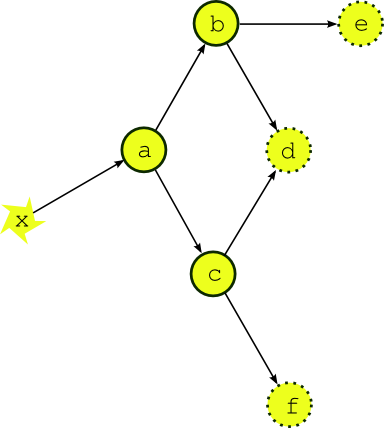
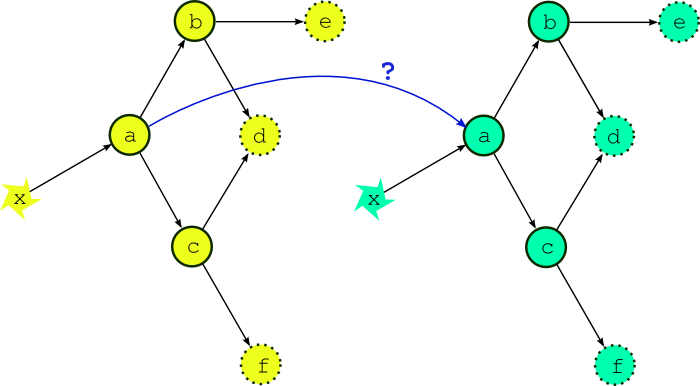
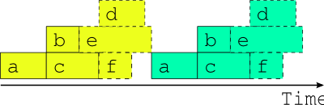
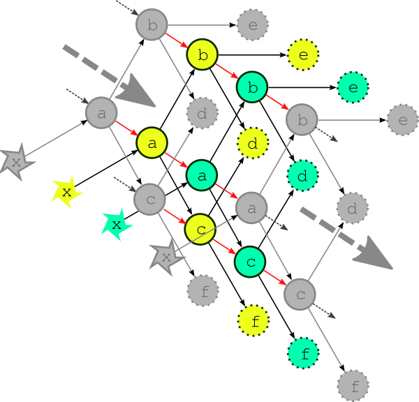

.. _HowCylcWorks:

Introduction: How Cylc Works
============================

.. _SchedulingForecastSuites:

Scheduling Forecast Suites
--------------------------

Environmental forecasting suites generate forecast products from a
potentially large group of interdependent scientific models and
associated data processing tasks. They are constrained by availability
of external driving data: typically one or more tasks will wait on real
time observations and/or model data from an external system, and these
will drive other downstream tasks, and so on. The dependency diagram for
a single forecast cycle point in such a system is a *Directed Acyclic Graph*
as shown in :numref:`fig-dep-one` (in our terminology, a
*forecast cycle point* is comprised of all tasks with a common *cycle point*,
which is the nominal analysis time or start time of the forecast
models in the group). In real time operation processing will consist of
a series of distinct forecast cycle points that are each initiated, after a
gap, by arrival of the new cycle point's external driving data.

From a job scheduling perspective task execution order in such a system
must be carefully controlled in order to avoid dependency violations.
Ideally, each task should be queued for execution at the instant its
last prerequisite is satisfied; this is the best that can be done even
if queued tasks are not able to execute immediately because of resource
contention.

.. _EcoConnect:

EcoConnect
----------

Cylc was developed for the EcoConnect Forecasting System at NIWA
(National Institute of Water and Atmospheric Research, New Zealand).
EcoConnect takes real time atmospheric and stream flow observations, and
operational global weather forecasts from the Met Office (UK), and uses
these to drive global sea state and regional data assimilating weather
models, which in turn drive regional sea state, storm surge, and
catchment river models, plus tide prediction, and a large number of
associated data collection, quality control, preprocessing,
post-processing, product generation, and archiving tasks [1]_.
The global sea state forecast runs once daily. The regional
weather forecast runs four times daily but
it supplies surface winds and pressure to several downstream models that
run only twice daily, and precipitation accumulations to catchment river
models that run on an hourly cycle assimilating real time stream flow
observations and using the most recently available regional weather
forecast. EcoConnect runs on heterogeneous distributed hardware,
including a massively parallel supercomputer and several Linux servers.

Dependence Between Tasks
------------------------

.. _IntracycleDependence:

Intra-cycle Dependence
^^^^^^^^^^^^^^^^^^^^^^

Most dependence between tasks applies within a single forecast cycle
point. :numref:`fig-dep-one` shows the dependency diagram for a single
forecast cycle point of a simple example suite of three forecast models
(*a*, *b*, and *c*) and three post processing or product generation
tasks (*d*, *e* and *f*). A scheduler capable of handling this
must manage, within a single forecast cycle point, multiple parallel
streams of execution that branch when one task generates output for
several downstream tasks, and merge when one task takes input from several
upstream tasks.

.. _fig-dep-one:

   A single cycle point dependency graph for a simple suite.
   The dependency graph for a single forecast cycle point of a simple
   example suite. Tasks *a*, *b*, and *c* represent forecast models,
   *d*, *e* and *f* are post processing or product generation
   tasks, and *x* represents external data that the upstream
   forecast model depends on.

.. _fig-time-one:

.. figure:: graphics/png/orig/timeline-one.png
   :align: center

   A single cycle point job schedule for real time operation.
   The optimal job schedule for two consecutive cycle points of our
   example suite during real time operation, assuming that all tasks
   trigger off upstream tasks finishing completely. The horizontal
   extent of a task bar represents its execution time, and the vertical
   blue lines show when the external driving data becomes available.

:numref:`fig-time-one` shows the optimal job schedule for two
consecutive cycle points of the example suite in real time operation, given
execution times represented by the horizontal extent of the task bars.
There is a time gap between cycle points as the suite waits on new external
driving data. Each task in the example suite happens to trigger off
upstream tasks *finishing*, rather than off any intermediate output
or event; this is merely a simplification that makes for clearer
diagrams.

.. _fig-dep-two-linked:

   What if the external driving data is available early? If the external
   driving data is available in advance, can we start running the next cycle
   point early?

.. _fig-overlap:

.. figure:: graphics/png/orig/timeline-one-c.png
   :align: center

   Attempted overlap of consecutive single-cycle-point job
   schedules. A naive attempt to overlap two consecutive cycle
   points using the single-cycle-point dependency graph. The red shaded
   tasks will fail because of dependency violations (or will not be able to
   run because of upstream dependency violations).

.. _fig-job-no-overlap:

   The only safe multi-cycle-point job schedule? The best that can be done
   *in general* when inter-cycle dependence is ignored.

Now the question arises, what happens if the external driving data for
upcoming cycle points is available in advance, as it would be after a
significant delay in operations, or when running a historical case
study?  While the forecast model *a* appears to depend only on the
external data *x* at this stage of the discussion, in fact it would
typically also depend on its own previous instance for the model
*background state* used in initializing the new forecast. Thus, as
alluded to in :numref:`fig-dep-two-linked`, task *a* could in principle
start as soon as its predecessor has finished. :numref:`fig-overlap`
shows, however, that starting a whole new cycle point at this point is
dangerous - it results in dependency violations in half of the tasks in
the example suite. In fact the situation could be even worse than this
- imagine that task *b* in the first cycle point is delayed for some
reason *after* the second cycle point has been launched. Clearly we must
consider handling inter-cycle dependence explicitly or else agree not to
start the next cycle point early, as is illustrated in
:numref:`fig-job-no-overlap`.

.. _InterCyclePointDependence:

Inter-Cycle Dependence
^^^^^^^^^^^^^^^^^^^^^^

Forecast models typically depend on their own most recent previous
forecast for background state or restart files of some kind (this is
called *warm cycling*) but there can also be inter-cycle dependence
between different tasks. In an atmospheric forecast analysis suite, for
instance, the weather model may generate background states for observation
processing and data-assimilation tasks in the next cycle point as well as for
the next forecast model run. In real time operation inter-cycle
dependence can be ignored because it is automatically satisfied when one cycle
point finishes before the next begins. If it is not ignored it drastically
complicates the dependency graph by blurring the clean boundary between
cycle points. :numref:`fig-dep-multi` illustrates the problem for our
simple example suite assuming minimal inter-cycle dependence: the warm
cycled models (*a*, *b*, and *c*) each depend on their own previous instances.

For this reason, and because we tend to see forecasting suites in terms of
their real time characteristics, other metaschedulers have ignored
inter-cycle dependence and are thus restricted to running entire cycle
points in sequence at all times. This does not affect normal real time
operation but it can be a serious impediment when advance availability of
external driving data makes it possible, in principle, to run some tasks from
upcoming cycle points before the current cycle point is finished - as was
suggested at the end of the previous section. This can occur, for instance,
after operational delays (late arrival of external data, system maintenance,
etc.) and to an even greater extent in historical case studies and parallel
test suites started behind a real time operation. It can be a serious problem
for suites that have little downtime between forecast cycle points and
therefore take many cycle points to catch up after a delay. Without taking
account of inter-cycle dependence, the best that can be done, in
general, is to reduce the gap between cycle points to zero as shown in
:numref:`fig-job-no-overlap`. A limited crude overlap of the single
cycle point job schedule may be possible for specific task sets but the
allowable overlap may change if new tasks are added, and it is still dangerous:
it amounts to running different parts of a dependent system as if they were not
dependent and as such it cannot be guaranteed that some unforeseen delay in
one cycle point, after the next cycle point has begun, (e.g. due to resource
contention or task failures) won't result in dependency violations.

.. _fig-dep-multi:

   The complete multi-cycle-point dependency graph.
   The complete dependency graph for the example suite, assuming
   the least possible inter-cycle dependence: the forecast models (*a*,
   *b*, and *c*) depend on their own previous instances. The dashed arrows
   show connections to previous and subsequent forecast cycle points.

.. _fig-optimal-two:

.. figure:: graphics/png/orig/timeline-two-cycles-optimal.png
   :align: center

   The optimal two-cycle-point job schedule. The optimal two cycle job
   schedule when the next cycle's driving data is available in
   advance, possible in principle when inter-cycle dependence is
   handled explicitly.

:numref:`fig-optimal-two` shows, in contrast to
:numref:`fig-overlap`, the optimal two cycle point job schedule
obtained by respecting all inter-cycle dependence. This assumes no delays due
to resource contention or otherwise - i.e. every task runs
as soon as it is ready to run. The scheduler running
this suite must be able to adapt dynamically to external conditions
that impact on multi-cycle-point scheduling in the presence of
inter-cycle dependence or else, again, risk bringing the system down
with dependency violations.

.. _fig-time-three:

.. figure:: graphics/png/orig/timeline-three.png
   :align: center

   Comparison of job schedules after a delay. Job
   schedules for the example suite after a delay of almost one whole
   forecast cycle point, when inter-cycle dependence is
   taken into account (above the time axis), and when it is not
   (below the time axis). The colored lines indicate the time that
   each cycle point is delayed, and normal "caught up" cycle points
   are shaded gray.

.. _fig-time-two:

.. figure:: graphics/png/orig/timeline-two.png
   :align: center

   Optimal job schedule when all external data is
   available. Job schedules for the example suite in case study
   mode, or after a long delay, when the external driving data are
   available many cycle points in advance. Above the time axis is the optimal
   schedule obtained when the suite is constrained only by its true
   dependencies, as in :numref:`fig-dep-two-linked`, and underneath
   is the best that can be done, in general, when inter-cycle
   dependence is ignored.

To further illustrate the potential benefits of proper inter-cycle
dependency handling, :numref:`fig-time-three` shows an operational
delay of almost one whole cycle point in a suite with little downtime between
cycle points. Above the time axis is the optimal schedule that is possible in
principle when inter-cycle dependence is taken into account, and below
it is the only safe schedule possible *in general* when it is ignored.
In the former case, even the cycle point immediately after the delay is hardly
affected, and subsequent cycle points are all on time, whilst in the latter
case it takes five full cycle points to catch up to normal real time
operation [2]_.

Similarly, :numref:`fig-time-two` shows example suite job schedules
for an historical case study, or when catching up after a very long
delay; i.e. when the external driving data are available many cycle
points in advance. Task *a*, which as the most upstream forecast
model is likely to be a resource intensive atmosphere or ocean model,
has no upstream dependence on co-temporal tasks and can therefore run
continuously, regardless of how much downstream processing is yet to be
completed in its own, or any previous, forecast cycle point (actually,
task *a* does depend on co-temporal task *x* which waits on the
external driving data, but that returns immediately when the data is
available in advance, so the result stands). The other forecast models
can also cycle continuously or with a short gap between, and some
post processing tasks, which have no previous-instance dependence, can
run continuously or even overlap (e.g. *e* in this case). Thus,
even for this very simple example suite, tasks from three or four
different cycle points can in principle run simultaneously at any given time.

In fact, if our tasks are able to trigger off internal outputs of
upstream tasks (message triggers) rather than waiting on full completion,
then successive instances of the forecast models could overlap as well
(because model restart outputs are generally completed early in the forecast)
for an even more efficient job schedule [3]_.

.. _TheCylcSchedulingAlgorithm:

The Cylc Scheduling Algorithm
-----------------------------

.. _fig-task-pool:

.. figure:: graphics/png/orig/task-pool.png
   :align: center

   The cylc task pool. How cylc sees a suite, in contrast to the
   multi-cycle-point dependency graph of :numref:`fig-dep-multi`.
   Task colors represent different cycle points, and the small squares
   and circles represent different prerequisites and outputs. A task
   can run when its prerequisites are satisfied by the outputs
   of other tasks in the pool.

Cylc manages a pool of proxy objects that represent the real tasks in a
suite. Task proxies know how to run the real tasks that they represent,
and they receive progress messages from the tasks as they run (usually
reports of completed outputs). There is no global cycling mechanism to
advance the suite; instead individual task proxies have their own
private cycle point and spawn their own successors when the time is
right. Task proxies are self-contained - they know their own
prerequisites and outputs but are not aware of the wider suite.
Inter-cycle dependence is not treated as special, and the task pool can
be populated with tasks with many different cycle points. The task pool
is illustrated in :numref:`fig-task-pool`. *Whenever any task
changes state due to completion of an output, every task checks to see
if its own prerequisites have been satisfied* [4]_.
In effect, cylc gets a pool of tasks to self-organize by negotiating
their own dependencies so that optimal scheduling, as described in the
previous section, emerges naturally at run time.

.. [1] Future plans for EcoConnect include additional deterministic regional
       weather forecasts and a statistical ensemble.
.. [2] Note that simply overlapping the single cycle point schedules of
       :numref:`fig-time-one` from the same start point would have
       resulted in dependency violation by task *c*.
.. [3] Finally, we note again that a good job scheduler should be able to
       dynamically adapt to delays in any part of the suite due to resource
       contention, varying run times, or anything else that will inevitably
       modify the depicted job schedules.
.. [4] In fact this dependency negotiation goes through a broker
       object (rather than every task literally checking every other task)
       which scales as *n* (rather than *n*:sup:`2`) where *n* is the number
       of task proxies in the pool.
