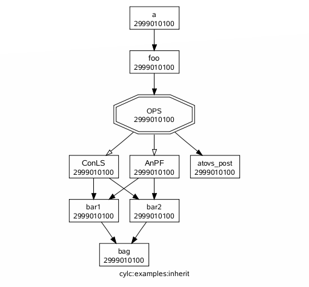

.. _SuiteDefinition:

Suite Configuration
===================

Cylc suites are defined in structured, validated, *suite.rc* files
that concisely specify the properties of, and the relationships
between, the various tasks managed by the suite. This section of the
User Guide deals with the format and content of the suite.rc file,
including task definition. Task implementation - what's required of the
real commands, scripts, or programs that do the processing that the
tasks represent - is covered in :ref:`TaskImplementation`; and
task job submission - how tasks are submitted to run - is
in :ref:`TaskJobSubmission`.

.. _SuiteDefinitionDirectories:

Suite Configuration Directories
-------------------------------

A cylc *suite configuration directory* contains:

- **A suite.rc file**: this is the suite configuration.

  - And any include-files used in it (see below; may be
    kept in sub-directories).

- **A** ``bin/`` **sub-directory** (optional)

  - For scripts and executables that implement, or are
    used by, suite tasks.
  - Automatically added to ``$PATH`` in task
    execution environments.
  - Alternatively, tasks can call external
    commands, scripts, or programs; or they can be scripted
    entirely within the suite.rc file.

- **A** ``lib/python/`` **sub-directory** (optional)

  - For custom job submission modules
    (see :ref:`CustomJobSubmissionMethods`)
    and local Python modules imported by custom Jinja2 filters,
    tests and globals (see :ref:`CustomJinja2Filters`).

- **Any other sub-directories and files** - documentation,
  control files, etc. (optional)

  - Holding everything in one place makes proper suite
    revision control possible.
  - Portable access to files here, for running tasks, is
    provided through ``$CYLC_SUITE_DEF_PATH``
    (see :ref:`TaskExecutionEnvironment`).
  - Ignored by cylc, but the entire suite configuration
    directory tree is copied when you copy a
    suite using cylc commands.

A typical example:

.. code-block:: bash

   /path/to/my/suite   # suite configuration directory
       suite.rc           # THE SUITE CONFIGURATION FILE
       bin/               # scripts and executables used by tasks
           foo.sh
           bar.sh
           ...
       # (OPTIONAL) any other suite-related files, for example:
       inc/               # suite.rc include-files
           nwp-tasks.rc
           globals.rc
           ...
       doc/               # documentation
       control/           # control files
       ancil/             # ancillary files
       ...

.. _SuiteRCFile:

Suite.rc File Overview
----------------------

Suite.rc files are an extended-INI format with section nesting.

Embedded template processor expressions may also be used in the file, to
programatically generate the final suite configuration seen by
cylc. Currently the `Jinja2 <http://jinja.pocoo.org/docs>`_ and
`EmPy <http://www.alcyone.com/software/empy>`_ template processors are
supported; see :ref:`Jinja` and :ref:`EmPylabel` for examples. In the future
cylc may provide a plug-in interface to allow use of other template
engines too.

.. _Syntax:

Syntax
^^^^^^

The following defines legal suite.rc syntax:

- **Items** are of the form ``item = value``.
- **[Section]** headings are enclosed in square brackets.
- **Sub-section [[nesting]]** is defined by repeated square brackets.

  - Sections are **closed** by the next section heading.

- **Comments** (line and trailing) follow a hash character: ``#``
- **List values** are comma-separated.
- **Single-line string values** can be single-, double-, or un-quoted.
- **Multi-line string values** are triple-quoted (using
  single or double quote characters).
- **Boolean values** are capitalized: True, False.
- **Leading and trailing whitespace** is ignored.
- **Indentation** is optional but should be used for clarity.
- **Continuation lines** follow a trailing backslash: ``\``
- **Duplicate sections** add their items to those previously
  defined under the same section.
- **Duplicate items** override, *except for dependency
  ``graph`` strings, which are additive*.
- **Include-files** ``%include inc/foo.rc`` can be
  used as a verbatim inlining mechanism.

Suites that embed templating code (see :ref:`Jinja` and :ref:`EmPylabel`) must
process to raw suite.rc syntax.

Include-Files
^^^^^^^^^^^^^

Cylc has native support for suite.rc include-files, which may help to
organize large suites. Inclusion boundaries are completely arbitrary -
you can think of include-files as chunks of the suite.rc file simply
cut-and-pasted into another file. Include-files may be included
multiple times in the same file, and even nested. Include-file paths
can be specified portably relative to the suite configuration directory,
e.g.:

.. code-block:: cylc

   # include the file $CYLC_SUITE_DEF_PATH/inc/foo.rc:
   %include inc/foo.rc

Editing Temporarily Inlined Suites
""""""""""""""""""""""""""""""""""

Cylc's native file inclusion mechanism supports optional inlined
editing:

.. code-block:: bash

   $ cylc edit --inline SUITE

The suite will be split back into its constituent include-files when you
exit the edit session. While editing, the inlined file becomes the
official suite configuration so that changes take effect whenever you save
the file. See ``cylc prep edit --help`` for more information.

Include-Files via Jinja2
""""""""""""""""""""""""

Jinja2 (:ref:`Jinja`) also has template inclusion functionality.

.. _SyntaxHighlighting:

Syntax Highlighting For Suite Configuration
^^^^^^^^^^^^^^^^^^^^^^^^^^^^^^^^^^^^^^^^^^^

Cylc comes with syntax files for a number of text editors:

.. code-block:: bash

   <cylc-dir>/etc/syntax/cylc.vim     # vim
   <cylc-dir>/etc/syntax/cylc-mode.el # emacs
   <cylc-dir>/etc/syntax/cylc.lang    # gedit (and other gtksourceview programs)
   <cylc-dir>/etc/syntax/cylc.xml     # kate

Refer to comments at the top of each file to see how to use them.

Gross File Structure
^^^^^^^^^^^^^^^^^^^^

Cylc suite.rc files consist of a suite title and description followed by
configuration items grouped under several top level section headings:

- **[cylc]** - *non task-specific suite configuration*
- **[scheduling]** - *determines when tasks are ready to run*

  - tasks with special behaviour, e.g. clock-trigger tasks
  - the dependency graph, which defines the relationships
    between tasks

- **[runtime]** - *determines how, where, and what to
  execute when tasks are ready*

  - script, environment, job submission, remote hosting, etc.
  - suite-wide defaults in the *root* namespace
  - a nested family hierarchy with common properties
    inherited by related tasks

- **[visualization]** - suite graph styling

.. _Validation:

Validation
^^^^^^^^^^

Cylc suite.rc files are automatically validated against a specification
that defines all legal entries, values, options, and defaults. This
detects formatting errors, typographic errors, illegal items and illegal
values prior to run time. Some values are complex strings that require
further parsing by cylc to determine their correctness (this is also
done during validation). All legal entries are documented in
(:ref:`SuiteRCReference`).

The validator reports the line numbers of detected errors. Here's an
example showing a section heading with a missing right bracket:

.. code-block:: bash

   $ cylc validate my.suite
       [[special tasks]
   'Section bracket mismatch, line 19'

If the suite.rc file uses include-files ``cylc view`` will
show an inlined copy of the suite with correct line numbers
(you can also edit suites in a temporarily inlined state with
``cylc edit --inline``).

Validation does not check the validity of chosen batch systems.

.. todo::

   This is to allow users to extend cylc with their own job submission
   methods, which are by definition unknown to the suite.rc spec.

.. _ConfiguringScheduling:

Scheduling - Dependency Graphs
------------------------------

The ``[scheduling]`` section of a suite.rc file defines the
relationships between tasks in a suite - the information that allows
cylc to determine when tasks are ready to run. The most important
component of this is the suite dependency graph. Cylc graph notation
makes clear textual graph representations that are very concise because
sections of the graph that repeat at different hours of the day, say,
only have to be defined once. Here's an example with dependencies that
vary depending on the particular cycle point:

.. code-block:: cylc

   [scheduling]
       initial cycle point = 20200401
       final cycle point = 20200405
       [[dependencies]]
           [[[T00,T06,T12,T18]]] # validity (hours)
               graph = """
   A => B & C   # B and C trigger off A
   A[-PT6H] => A  # Model A restart trigger
                       """
           [[[T06,T18]]] # hours
               graph = "C => X"

:numref:`fig-dep-eg-1` shows the complete suite.rc listing alongside
the suite graph. This is a complete, valid, runnable suite (it will
use default task runtime properties such as ``script``).

.. Need to use a 'container' directive to get centered image with
   left-aligned caption (as required for code block text).

.. container:: twocol

   .. container:: image

      .. _fig-dep-eg-1:

      .. figure:: graphics/png/orig/dep-eg-1.png
         :align: center

   .. container:: caption

      Example Suite

      .. code-block:: cylc

         [meta]
             title = "Dependency Example 1"
         [cylc]
             UTC mode = True
         [scheduling]
             initial cycle point = 20200401
             final cycle point = 20200405
             [[dependencies]]
                 [[[T00,T06,T12,T18]]] # validity (hours)
                     graph = """
         A => B & C   # B and C trigger off A
         A[-PT6H] => A  # Model A restart trigger
                             """
                 [[[T06,T18]]] # hours
                     graph = "C => X"
         [visualization]
             initial cycle point = 20200401
             final cycle point = 20200401T06
             [[node attributes]]
                 X = "color=red"

Graph String Syntax
^^^^^^^^^^^^^^^^^^^

Multiline graph strings may contain:

- **blank lines**
- **arbitrary white space**
- **internal comments**: following the ``#`` character
- **conditional task trigger expressions** - see below.

Interpreting Graph Strings
^^^^^^^^^^^^^^^^^^^^^^^^^^

Suite dependency graphs can be broken down into pairs in which the left
side (which may be a single task or family, or several that are
conditionally related) defines a trigger for the task or family on the
right. For instance the "word graph" *C triggers off B which
triggers off A* can be deconstructed into pairs *C triggers off B*
and *B triggers off A*. In this section we use only the default
trigger type, which is to trigger off the upstream task succeeding;
see :ref:`TriggerTypes` for other available triggers.

In the case of cycling tasks, the triggers defined by a graph string are
valid for cycle points matching the list of hours specified for the
graph section. For example this graph:

.. code-block:: cylc

   [scheduling]
       [[dependencies]]
           [[[T00,T12]]]
               graph = "A => B"

implies that B triggers off A for cycle points in which the hour matches ``00``
or ``12``.

To define inter-cycle dependencies, attach an offset indicator to the
left side of a pair:

.. code-block:: cylc

   [scheduling]
       [[dependencies]]
           [[[T00,T12]]]
               graph = "A[-PT12H] => B"

This means B[time] triggers off A[time-PT12H] (12 hours before) for cycle
points with hours matching ``00`` or ``12``. ``time`` is implicit because
this keeps graphs clean and concise, given that the
majority of tasks will typically
depend only on others with the same cycle point. Cycle point offsets can only
appear on the left of a pair, because a pairs define triggers for the right
task at cycle point ``time``. However, ``A => B[-PT6H]``, which is
illegal, can be reformulated as a *future trigger*
``A[+PT6H] => B`` (see :ref:`InterCyclePointTriggers`). It is also
possible to combine multiple offsets within a cycle point offset e.g.

.. code-block:: cylc

   [scheduling]
       [[dependencies]]
           [[[T00,T12]]]
               graph = "A[-P1D-PT12H] => B"

This means that B[Time] triggers off A[time-P1D-PT12H] (1 day and 12 hours
before).

Triggers can be chained together. This graph:

.. code-block:: cylc

   graph = """A => B  # B triggers off A
              B => C  # C triggers off B"""

is equivalent to this:

.. code-block:: cylc

   graph = "A => B => C"

*Each trigger in the graph must be unique* but *the same task
can appear in multiple pairs or chains*. Separately defined triggers
for the same task have an AND relationship. So this:

.. code-block:: cylc

   graph = """A => X  # X triggers off A
              B => X  # X also triggers off B"""

is equivalent to this:

.. code-block:: cylc

   graph = "A & B => X"  # X triggers off A AND B

In summary, the branching tree structure of a dependency graph can
be partitioned into lines (in the suite.rc graph string) of pairs
or chains, in any way you like, with liberal use of internal white space
and comments to make the graph structure as clear as possible.

.. code-block:: cylc

   # B triggers if A succeeds, then C and D trigger if B succeeds:
       graph = "A => B => C & D"
   # which is equivalent to this:
       graph = """A => B => C
                  B => D"""
   # and to this:
       graph = """A => B => D
                  B => C"""
   # and to this:
       graph = """A => B
                  B => C
                  B => D"""
   # and it can even be written like this:
       graph = """A => B # blank line follows:

                  B => C # comment ...
                  B => D"""

Splitting Up Long Graph Lines
"""""""""""""""""""""""""""""

It is not necessary to use the general line continuation marker
``\`` to split long graph lines. Just break at dependency arrows,
or split long chains into smaller ones. This graph:

.. code-block:: cylc

   graph = "A => B => C"

is equivalent to this:

.. code-block:: cylc

   graph = """A => B =>
              C"""

and also to this:

.. code-block:: cylc

   graph = """A => B
              B => C"""

.. _GraphTypes:

Graph Types
^^^^^^^^^^^

A suite configuration can contain multiple graph strings that are combined
to generate the final graph.

One-off (Non-Cycling)
"""""""""""""""""""""

:numref:`fig-test1` shows a small suite of one-off non-cycling
tasks; these all share a single cycle point (``1``) and don't spawn
successors (once they're all finished the suite just exits). The integer
``1`` attached to each graph node is just an arbitrary label here.

.. Need to use a 'container' directive to get centered image with
   left-aligned caption (as required for code block text).

.. container:: twocol

   .. container:: image

      .. _fig-test1:

      .. figure:: graphics/png/orig/test1.png
         :align: center

   .. container:: caption

      One-off (Non-Cycling) Tasks.

      .. code-block:: cylc

         [meta]
             title = some one-off tasks
         [scheduling]
             [[dependencies]]
                 graph = "foo => bar & baz => qux"

Cycling Graphs
""""""""""""""

For cycling tasks the graph section heading defines a sequence of cycle points
for which the subsequent graph section is valid. :numref:`fig-test2`
shows a small suite of cycling tasks.

.. Need to use a 'container' directive to get centered image with
   left-aligned caption (as required for code block text).

.. container:: twocol

   .. container:: image

      .. _fig-test2:

      .. figure:: graphics/png/orig/test2.png
         :align: center

   .. container:: caption

      Cycling Tasks.

      .. code-block:: cylc

         [meta]
             title = some cycling tasks
         # (no dependence between cycle points)
         [scheduling]
             [[dependencies]]
                 [[[T00,T12]]]
                     graph = "foo => bar & baz => qux"

Graph Section Headings
^^^^^^^^^^^^^^^^^^^^^^

Graph section headings define recurrence expressions, the graph within a graph
section heading defines a workflow at each point of the recurrence. For
example in the following scenario:

.. code-block:: cylc

   [scheduling]
       [[dependencies]]
           [[[ T06 ]]]  # A graph section heading
               graph = foo => bar

``T06`` means "Run every day starting at 06:00 after the
initial cycle point". Cylc allows you to start (or end) at any particular
time, repeat at whatever frequency you like, and even optionally limit the
number of repetitions.

Graph section heading can also be used with integer cycling see
:ref:`IntegerCycling`.

Syntax Rules
""""""""""""

Date-time cycling information is made up of a starting *date-time*, an
*interval*, and an optional *limit*.

The time is assumed to be in the local time zone unless you set
``[cylc]cycle point time zone`` or ``[cylc]UTC mode``. The
calendar is assumed to be the proleptic Gregorian calendar unless you set
``[scheduling]cycling mode``.

The syntax for representations is based on the ISO 8601 date-time standard.
This includes the representation of *date-time*, *interval*. What we
define for cylc's cycling syntax is our own optionally-heavily-condensed form
of ISO 8601 recurrence syntax. The most common full form is:
``R[limit?]/[date-time]/[interval]``. However, we allow omitting
information that can be guessed from the context (rules below). This means
that it can be written as:

.. code-block:: none

   R[limit?]/[date-time]
   R[limit?]//[interval]
   [date-time]/[interval]
   R[limit?] # Special limit of 1 case
   [date-time]
   [interval]

with example graph headings for each form being:

.. code-block:: cylc

   [[[ R5/T00 ]]]           # Run 5 times at 00:00 every day
   [[[ R//PT1H ]]]          # Run every hour (Note the R// is redundant)
   [[[ 20000101T00Z/P1D ]]] # Run every day starting at 00:00 1st Jan 2000
   [[[ R1 ]]]               # Run once at the initial cycle point
   [[[ R1/20000101T00Z ]]]  # Run once at 00:00 1st Jan 2000
   [[[ P1Y ]]]              # Run every year

.. note::

   ``T00`` is an example of ``[date-time]``, with an
   inferred 1 day period and no limit.

Where some or all *date-time* information is omitted, it is inferred to
be relative to the initial date-time cycle point. For example, ``T00``
by itself would mean the next occurrence of midnight that follows, or is, the
initial cycle point. Entering ``+PT6H`` would mean 6 hours after the
initial cycle point. Entering ``-P1D`` would mean 1 day before the
initial cycle point. Entering no information for the *date-time* implies
the initial cycle point date-time itself.

Where the *interval* is omitted and some (but not all) *date-time*
information is omitted, it is inferred to be a single unit above
the largest given specific *date-time* unit. For example, the largest
given specific unit in ``T00`` is hours, so the inferred interval is
1 day (daily), ``P1D``.

Where the *limit* is omitted, unlimited cycling is assumed. This will be
bounded by the final cycle point's date-time if given.

Another supported form of ISO 8601 recurrence is:
``R[limit?]/[interval]/[date-time]``. This form uses the
*date-time* as the end of the cycling sequence rather than the start.
For example, ``R3/P5D/20140430T06`` means:

.. code-block:: none

   20140420T06
   20140425T06
   20140430T06

This kind of form can be used for specifying special behaviour near the end of
the suite, at the final cycle point's date-time. We can also represent this in
cylc with a collapsed form:

.. code-block:: none

   R[limit?]/[interval]
   R[limit?]//[date-time]
   [interval]/[date-time]

So, for example, you can write:

.. code-block:: cylc

   [[[ R1//+P0D ]]]  # Run once at the final cycle point
   [[[ R5/P1D ]]]    # Run 5 times, every 1 day, ending at the final
                     # cycle point
   [[[ P2W/T00 ]]]   # Run every 2 weeks ending at 00:00 following
                     # the final cycle point
   [[[ R//T00 ]]]    # Run every 1 day ending at 00:00 following the
                     # final cycle point

.. _referencing-the-initial-and-final-cycle-points:

Referencing The Initial And Final Cycle Points
""""""""""""""""""""""""""""""""""""""""""""""

For convenience the caret and dollar symbols may be used as shorthand for the
initial and final cycle points. Using this shorthand you can write:

.. code-block:: cylc

   [[[ R1/^+PT12H ]]]  # Repeat once 12 hours after the initial cycle point
                       # R[limit]/[date-time]
                       # Equivalent to [[[ R1/+PT12H ]]]
   [[[ R1/$ ]]]        # Repeat once at the final cycle point
                       # R[limit]/[date-time]
                       # Equivalent to [[[ R1//+P0D ]]]
   [[[ $-P2D/PT3H ]]]  # Repeat 3 hourly starting two days before the
                       # [date-time]/[interval]
                       # final cycle point

.. note::

   There can be multiple ways to write the same headings, for instance
   the following all run once at the final cycle point:

   .. code-block:: cylc

      [[[ R1/P0Y ]]]      # R[limit]/[interval]
      [[[ R1/P0Y/$ ]]]    # R[limit]/[interval]/[date-time]
      [[[ R1/$ ]]]        # R[limit]/[date-time]

.. _excluding-dates:

Excluding Dates
"""""""""""""""

Date-times can be excluded from a recurrence by an exclamation mark for
example ``[[[ PT1D!20000101 ]]]`` means run daily except on the
first of January 2000.

This syntax can be used to exclude one or multiple date-times from a
recurrence. Multiple date-times are excluded using the syntax
``[[[ PT1D!(20000101,20000102,...) ]]]``. All date-times listed within
the parentheses after the exclamation mark will be excluded.

.. note::

   The ``^`` and ``$`` symbols (shorthand for the initial
   and final cycle points) are both date-times so ``[[[ T12!$-PT1D ]]]``
   is valid.

If using a run limit in combination with an exclusion, the heading might not
run the number of times specified in the limit. For example in the following
suite ``foo`` will only run once as its second run has been excluded.

.. code-block:: cylc

   [scheduling]
       initial cycle point = 20000101T00Z
       final cycle point = 20000105T00Z
       [[dependencies]]
           [[[ R2/P1D!20000102 ]]]
               graph = foo

Advanced exclusion syntax
"""""""""""""""""""""""""

In addition to excluding isolated date-time points or lists of date-time points
from recurrences, exclusions themselves may be date-time recurrence sequences.
Any partial date-time or sequence given after the exclamation mark will be
excluded from the main sequence.

For example, partial date-times can be excluded using the syntax:

.. code-block:: cylc

   [[[ PT1H ! T12 ]]]          # Run hourly but not at 12:00 from the initial
                               # cycle point.
   [[[ T-00 ! (T00, T06, T12, T18) ]]]   # Run hourly but not at 00:00, 06:00,
                                         # 12:00, 18:00.
   [[[ PT5M ! T-15 ]]]         # Run 5-minutely but not at 15 minutes past the
                               # hour from the initial cycle point.
   [[[ T00 ! W-1T00 ]]]        # Run daily at 00:00 except on Mondays.

It is also valid to use sequences for exclusions. For example:

.. code-block:: cylc

   [[[ PT1H ! PT6H ]]]         # Run hourly from the initial cycle point but
                               # not 6-hourly from the initial cycle point.
   [[[ T-00 ! PT6H ]]]         # Run hourly on the hour but not 6-hourly
                               # on the hour.
       # Same as [[[ T-00 ! T-00/PT6H ]]] (T-00 context is implied)
       # Same as [[[ T-00 ! (T00, T06, T12, T18) ]]]
       # Same as [[[ PT1H ! (T00, T06, T12, T18) ]]] Initial cycle point dependent

   [[[ T12 ! T12/P15D ]]]      # Run daily at 12:00 except every 15th day.

   [[[ R/^/P1H ! R5/20000101T00/P1D ]]]    # Any valid recurrence may be used to
                                           # determine exclusions. This example
                                           # translates to: Repeat every hour from
                                           # the initial cycle point, but exclude
                                           # 00:00 for 5 days from the 1st January
                                           # 2000.

You can combine exclusion sequences and single point exclusions within a
comma separated list enclosed in parentheses:

.. code-block:: cylc

   [[[ T-00 ! (20000101T07, PT2H) ]]]      # Run hourly on the hour but not at 07:00
                                           # on the 1st Jan, 2000 and not 2-hourly
                                           # on the hour.

.. _HowMultipleGraphStringsCombine:

How Multiple Graph Strings Combine
""""""""""""""""""""""""""""""""""

For a cycling graph with multiple validity sections for different
hours of the day, the different sections *add* to generate the
complete graph. Different graph sections can overlap (i.e. the same
hours may appear in multiple section headings) and the same tasks may
appear in multiple sections, but individual dependencies should be
unique across the entire graph. For example, the following graph defines
a duplicate prerequisite for task C:

.. code-block:: cylc

   [scheduling]
       [[dependencies]]
           [[[T00,T06,T12,T18]]]
               graph = "A => B => C"
           [[[T06,T18]]]
               graph = "B => C => X"
               # duplicate prerequisite: B => C already defined at T06, T18

This does not affect scheduling, but for the sake of clarity and brevity
the graph should be written like this:

.. code-block:: cylc

   [scheduling]
       [[dependencies]]
           [[[T00,T06,T12,T18]]]
               graph = "A => B => C"
           [[[T06,T18]]]
               # X triggers off C only at 6 and 18 hours
               graph = "C => X"

.. _AdvancedCycling:

Advanced Examples
"""""""""""""""""

The following examples show the various ways of writing graph headings in cylc.

.. code-block:: cylc

   [[[ R1 ]]]         # Run once at the initial cycle point
   [[[ P1D ]]]        # Run every day starting at the initial cycle point
   [[[ PT5M ]]]       # Run every 5 minutes starting at the initial cycle
                      # point
   [[[ T00/P2W ]]]    # Run every 2 weeks starting at 00:00 after the
                      # initial cycle point
   [[[ +P5D/P1M ]]]   # Run every month, starting 5 days after the initial
                      # cycle point
   [[[ R1/T06 ]]]     # Run once at 06:00 after the initial cycle point
   [[[ R1/P0Y ]]]     # Run once at the final cycle point
   [[[ R1/$ ]]]       # Run once at the final cycle point (alternative
                      # form)
   [[[ R1/$-P3D ]]]   # Run once three days before the final cycle point
   [[[ R3/T0830 ]]]   # Run 3 times, every day at 08:30 after the initial
                      # cycle point
   [[[ R3/01T00 ]]]   # Run 3 times, every month at 00:00 on the first
                      # of the month after the initial cycle point
   [[[ R5/W-1/P1M ]]] # Run 5 times, every month starting on Monday
                      # following the initial cycle point
   [[[ T00!^ ]]]      # Run at the first occurrence of T00 that isn't the
                      # initial cycle point
   [[[ PT1D!20000101 ]]]  # Run every day days excluding 1st Jan 2000
   [[[ 20140201T06/P1D ]]]    # Run every day starting at 20140201T06
   [[[ R1/min(T00,T06,T12,T18) ]]]  # Run once at the first instance
                                    # of either T00, T06, T12 or T18
                                    # starting at the initial cycle
                                    # point

.. _AdvancedStartingUp:

Advanced Starting Up
""""""""""""""""""""

Dependencies that are only valid at the initial cycle point can be written
using the ``R1`` notation (e.g. as in :ref:`initial-non-repeating-r1-tasks`.
For example:

.. code-block:: cylc

   [cylc]
       UTC mode = True
   [scheduling]
       initial cycle point = 20130808T00
       final cycle point = 20130812T00
       [[dependencies]]
           [[[R1]]]
               graph = "prep => foo"
           [[[T00]]]
               graph = "foo[-P1D] => foo => bar"

In the example above, ``R1`` implies ``R1/20130808T00``, so
``prep`` only runs once at that cycle point (the initial cycle point).
At that cycle point, ``foo`` will have a dependence on
``prep`` - but not at subsequent cycle points.

However, it is possible to have a suite that has multiple effective initial
cycles - for example, one starting at ``T00`` and another starting
at ``T12``. What if they need to share an initial task?

Let's suppose that we add the following section to the suite example above:

.. code-block:: cylc

   [cylc]
       UTC mode = True
   [scheduling]
       initial cycle point = 20130808T00
       final cycle point = 20130812T00
       [[dependencies]]
           [[[R1]]]
               graph = "prep => foo"
           [[[T00]]]
               graph = "foo[-P1D] => foo => bar"
           [[[T12]]]
               graph = "baz[-P1D] => baz => qux"

We'll also say that there should be a starting dependence between
``prep`` and our new task ``baz`` - but we still want to have
a single ``prep`` task, at a single cycle.

We can write this using a special case of the ``task[-interval]`` syntax -
if the interval is null, this implies the task at the initial cycle point.

For example, we can write our suite like :numref:`fig-test4`.

.. Need to use a 'container' directive to get centered image with
   left-aligned caption (as required for code block text).

.. container:: twocol

   .. container:: image

      .. _fig-test4:

      .. figure:: graphics/png/orig/test4.png
         :align: center

   .. container:: caption

      Staggered Start Suite

      .. code-block:: cylc

         [cylc]
             UTC mode = True
         [scheduling]
             initial cycle point = 20130808T00
             final cycle point = 20130812T00
             [[dependencies]]
                 [[[R1]]]
                     graph = "prep"
                 [[[R1/T00]]]
         # ^ implies the initial cycle point:
              graph = "prep[^] => foo"
                 [[[R1/T12]]]
         # ^ is initial cycle point, as above:
              graph = "prep[^] => baz"
                 [[[T00]]]
              graph = "foo[-P1D] => foo => bar"
                 [[[T12]]]
              graph = "baz[-P1D] => baz => qux"
         [visualization]
             initial cycle point = 20130808T00
             final cycle point = 20130810T00
             [[node attributes]]
                 foo = "color=red"
                 bar = "color=orange"
                 baz = "color=green"
                 qux = "color=blue"

This neatly expresses what we want - a task running at the initial cycle point
that has one-off dependencies with other task sets at different cycles.

.. Need to use a 'container' directive to get centered image with
   left-aligned caption (as required for code block text).

.. container:: twocol

   .. container:: image

      .. _fig-test5:

      .. figure:: graphics/png/orig/test5.png
         :align: center

   .. container:: caption

      Restricted First Cycle Point Suite

      .. code-block:: cylc

          [cylc]
              UTC mode = True
          [scheduling]
              initial cycle point = 20130808T00
              final cycle point = 20130808T18
              [[dependencies]]
                  [[[R1]]]
                      graph = "setup_foo => foo"
                  [[[+PT6H/PT6H]]]
                      graph = """
                          foo[-PT6H] => foo
                          foo => bar
                      """
          [visualization]
              initial cycle point = 20130808T00
              final cycle point = 20130808T18
              [[node attributes]]
                  foo = "color=red"
                  bar = "color=orange"

A different kind of requirement is displayed in :numref:`fig-test5`.
Usually, we want to specify additional tasks and dependencies at the initial
cycle point. What if we want our first cycle point to be entirely special,
with some tasks missing compared to subsequent cycle points?

In :numref:`fig-test5`, ``bar`` will not be run at the initial
cycle point, but will still run at subsequent cycle points.
``[[[+PT6H/PT6H]]]`` means start at ``+PT6H`` (6 hours after
the initial cycle point) and then repeat every ``PT6H`` (6 hours).

Some suites may have staggered start-up sequences where different tasks need
running once but only at specific cycle points, potentially due to differing
data sources at different cycle points with different possible initial cycle
points. To allow this cylc provides a ``min( )`` function that can be
used as follows:

.. code-block:: cylc

   [cylc]
       UTC mode = True
   [scheduling]
       initial cycle point = 20100101T03
       [[dependencies]]
           [[[R1/min(T00,T12)]]]
               graph = "prep1 => foo"
           [[[R1/min(T06,T18)]]]
               graph = "prep2 => foo"
           [[[T00,T06,T12,T18]]]
               graph = "foo => bar"

In this example the initial cycle point is ``20100101T03``, so the
``prep1`` task will run once at ``20100101T12`` and the
``prep2`` task will run once at ``20100101T06`` as these are
the first cycle points after the initial cycle point in the respective
``min( )`` entries.

.. _IntegerCycling:

Integer Cycling
"""""""""""""""

In addition to non-repeating and date-time cycling workflows, cylc can do
integer cycling for repeating workflows that are not date-time based.

To construct an integer cycling suite, set
``[scheduling]cycling mode = integer``, and specify integer values for
the initial and (optional) final cycle points. The notation for intervals,
offsets, and recurrences (sequences) is similar to the date-time cycling
notation, except for the simple integer values.

The full integer recurrence expressions supported are:

- ``Rn/start-point/interval # e.g. R3/1/P2``
- ``Rn/interval/end-point # e.g. R3/P2/9``

But, as for date-time cycling, sequence start and end points can be omitted
where suite initial and final cycle points can be assumed. Some examples:

.. code-block:: cylc

   [[[ R1 ]]]        # Run once at the initial cycle point
                     # (short for R1/initial-point/?)
   [[[ P1 ]]]        # Repeat with step 1 from the initial cycle point
                     # (short for R/initial-point/P1)
   [[[ P5 ]]]        # Repeat with step 5 from the initial cycle point
                     # (short for R/initial-point/P5)
   [[[ R2//P2 ]]]    # Run twice with step 3 from the initial cycle point
                     # (short for R2/initial-point/P2)
   [[[ R/+P1/P2 ]]]  # Repeat with step 2, from 1 after the initial cycle point
   [[[ R2/P2 ]]]     # Run twice with step 2, to the final cycle point
                     # (short for R2/P2/final-point)
   [[[ R1/P0 ]]]     # Run once at the final cycle point
                     # (short for R1/P0/final-point)

Example
'''''''

The tutorial illustrates integer cycling in :ref:`TutInteger`, and
``<cylc-dir>/etc/examples/satellite/`` is a
self-contained example of a realistic use for integer cycling. It simulates
the processing of incoming satellite data: each new dataset arrives after a
random (as far as the suite is concerned) interval, and is labeled by an
arbitrary (as far as the suite is concerned) ID in the filename. A task called
``get_data`` at the top of the repeating workflow waits on the next
dataset and, when it finds one, moves it to a cycle-point-specific shared
workspace for processing by the downstream tasks. When ``get_data.1``
finishes, ``get_data.2`` triggers and begins waiting for the next
dataset at the same time as the downstream tasks in cycle point 1 are
processing the first one, and so on. In this way multiple datasets can be
processed at once if they happen to come in quickly. A single shutdown task
runs at the end of the final cycle to collate results. The suite graph is
shown in :numref:`fig-satellite`.

.. _fig-satellite:

   The ``etc/examples/satellite`` integer suite.

Advanced Integer Cycling Syntax
'''''''''''''''''''''''''''''''

The same syntax used to reference the initial and final cycle points
(introduced in :ref:`referencing-the-initial-and-final-cycle-points`) for
use with date-time cycling can also be used for integer cycling. For
example you can write:

.. code-block:: cylc

   [[[ R1/^ ]]]     # Run once at the initial cycle point
   [[[ R1/$ ]]]     # Run once at the final cycle point
   [[[ R3/^/P2 ]]]  # Run three times with step two starting at the
                    # initial cycle point

Likewise the syntax introduced in :ref:`excluding-dates` for excluding
a particular point from a recurrence also works for integer cycling. For
example:

.. code-block:: cylc

   [[[ R/P4!8 ]]]       # Run with step 4, to the final cycle point
                        # but not at point 8
   [[[ R3/3/P2!5 ]]]    # Run with step 2 from point 3 but not at
                        # point 5
   [[[ R/+P1/P6!14 ]]]  # Run with step 6 from 1 step after the
                        # initial cycle point but not at point 14

Multiple integer exclusions are also valid in the same way as the syntax
in :ref:`excluding-dates`. Integer exclusions may be a list of single
integer points, an integer sequence, or a combination of both:

.. code-block:: cylc

   [[[ R/P1!(2,3,7) ]]]  # Run with step 1 to the final cycle point,
                         # but not at points 2, 3, or 7.
   [[[ P1 ! P2 ]]]       # Run with step 1 from the initial to final
                         # cycle point, skipping every other step from
                         # the initial cycle point.
   [[[ P1 ! +P1/P2 ]]]   # Run with step 1 from the initial cycle point,
                         # excluding every other step beginning one step
                         # after the initial cycle point.
   [[[ P1 !(P2,6,8) ]]]  # Run with step 1 from the initial cycle point,
                         # excluding every other step, and also excluding
                         # steps 6 and 8.

.. _TriggerTypes:

Task Triggering
^^^^^^^^^^^^^^^

A task is said to "trigger" when it submits its job to run, as soon as all of
its dependencies (also known as its separate "triggers") are met. Tasks can
be made to trigger off of the state of other tasks (indicated by a
``:state`` qualifier on the upstream task (or family)
name in the graph) and, and off the clock, and arbitrary external events.

External triggering is relatively more complicated, and is documented
separately in :ref:`External Triggers`.

Success Triggers
""""""""""""""""

The default, with no trigger type specified, is to trigger off the
upstream task succeeding:

.. code-block:: cylc

   # B triggers if A SUCCEEDS:
       graph = "A => B"

For consistency and completeness, however, the success trigger can be
explicit:

.. code-block:: cylc

   # B triggers if A SUCCEEDS:
       graph = "A => B"
   # or:
       graph = "A:succeed => B"

Failure Triggers
""""""""""""""""

To trigger off the upstream task reporting failure:

.. code-block:: cylc

   # B triggers if A FAILS:
       graph = "A:fail => B"

*Suicide triggers* can be used to remove task ``B`` here if
``A`` does not fail, see :ref:`SuicideTriggers`.

Start Triggers
""""""""""""""

To trigger off the upstream task starting to execute:

.. code-block:: cylc

   # B triggers if A STARTS EXECUTING:
       graph = "A:start => B"

This can be used to trigger tasks that monitor other tasks once they
(the target tasks) start executing. Consider a long-running forecast model,
for instance, that generates a sequence of output files as it runs. A
postprocessing task could be launched with a start trigger on the model
(``model:start => post``) to process the model output as it
becomes available. Note, however, that there are several alternative
ways of handling this scenario: both tasks could be triggered at the
same time (``foo => model & post``), but depending on
external queue delays this could result in the monitoring task starting
to execute first; or a different postprocessing task could be
triggered off a message output for each data file
(``model:out1 => post1`` etc.; see :ref:`MessageTriggers`), but this
may not be practical if the
number of output files is large or if it is difficult to add cylc
messaging calls to the model.

Finish Triggers
"""""""""""""""

To trigger off the upstream task succeeding or failing, i.e. finishing
one way or the other:

.. code-block:: cylc

   # B triggers if A either SUCCEEDS or FAILS:
       graph = "A | A:fail => B"
   # or
       graph = "A:finish => B"

.. _MessageTriggers:

Message Triggers
""""""""""""""""

Tasks can also trigger off custom output messages. These must be registered in
the ``[runtime]`` section of the emitting task, and reported using the
``cylc message`` command in task scripting. The graph trigger notation
refers to the item name of the registered output message.
The example suite ``<cylc-dir>/etc/examples/message-triggers`` illustrates
message triggering.

.. literalinclude:: ../../etc/examples/message-triggers/suite.rc
   :language: cylc

Job Submission Triggers
"""""""""""""""""""""""

It is also possible to trigger off a task submitting, or failing to submit:

.. code-block:: cylc

   # B triggers if A submits successfully:
       graph = "A:submit => B"
   # D triggers if C fails to submit successfully:
       graph = "C:submit-fail => D"

A possible use case for submit-fail triggers: if a task goes into the
submit-failed state, possibly after several job submission retries,
another task that inherits the same runtime but sets a different job
submission method and/or host could be triggered to, in effect, run the
same job on a different platform.

Conditional Triggers
""""""""""""""""""""

AND operators (``&``) can appear on both sides of an arrow. They
provide a concise alternative to defining multiple triggers separately:

.. code-block:: cylc

   # 1/ this:
       graph = "A & B => C"
   # is equivalent to:
       graph = """A => C
                  B => C"""
   # 2/ this:
       graph = "A => B & C"
   # is equivalent to:
       graph = """A => B
                  A => C"""
   # 3/ and this:
       graph = "A & B => C & D"
   # is equivalent to this:
       graph = """A => C
                  B => C
                  A => D
                  B => D"""

OR operators (``|``) which result in true conditional triggers,
can only appear on the left [1]_ :

.. code-block:: cylc

   # C triggers when either A or B finishes:
       graph = "A | B => C"

Forecasting suites typically have simple conditional
triggering requirements, but any valid conditional expression can be
used, as shown in :numref:`fig-conditional`
(conditional triggers are plotted with open arrow heads).

.. Need to use a 'container' directive to get centered image with
   left-aligned caption (as required for code block text).

.. container:: twocol

   .. container:: image

      .. _fig-conditional:

      .. figure:: graphics/png/orig/conditional-triggers.png
         :align: center

   .. container:: caption

      Conditional triggers, which are plotted with open arrow heads.

      .. code-block:: cylc

                 graph = """
         # D triggers if A or (B and C) succeed
         A | B & C => D
         # just to align the two graph sections
         D => W
         # Z triggers if (W or X) and Y succeed
         (W|X) & Y => Z
                         """

.. _SuicideTriggers:

Suicide Triggers
""""""""""""""""

Suicide triggers take tasks out of the suite. This can be used for
automated failure recovery. The suite.rc listing and accompanying
graph in :numref:`fig-suicide` show how to define a chain of failure
recovery tasks that trigger if they're needed but
otherwise remove themselves from the
suite (you can run the *AutoRecover.async* example suite to see how
this works). The dashed graph edges ending in solid dots indicate
suicide triggers, and the open arrowheads indicate conditional triggers
as usual. Suicide triggers are ignored by default in the graph view, unless
you toggle them on with *View* ``->`` *Options* ``->``
*Ignore Suicide Triggers*.

.. Need to use a 'container' directive to get centered image with
   left-aligned caption (as required for code block text).

.. container:: twocol

   .. container:: image

      .. _fig-suicide:

      .. figure:: graphics/png/orig/suicide.png
         :align: center

   .. container:: caption

      Automated failure recovery via suicide triggers.

      .. code-block:: cylc

          [meta]
              title = automated failure recovery
              description = """
          Model task failure triggers diagnosis
          and recovery tasks, which take themselves
          out of the suite if model succeeds. Model
          post processing triggers off model OR
          recovery tasks.
                        """
          [scheduling]
              [[dependencies]]
                  graph = """
          pre => model
          model:fail => diagnose => recover
          model => !diagnose & !recover
          model | recover => post
                          """
          [runtime]
              [[model]]
                  # UNCOMMENT TO TEST FAILURE:
                  # script = /bin/false

.. note::

   Multiple suicide triggers combine in the same way as other
   triggers, so this:

   .. code-block:: cylc

      foo => !baz
      bar => !baz

   is equivalent to this:

   .. code-block:: cylc

      foo & bar => !baz

   i.e. both ``foo`` and ``bar`` must succeed for
   ``baz`` to be taken out of the suite. If you really want a task
   to be taken out if any one of several events occurs then be careful to
   write it that way:

   .. code-block:: cylc

      foo | bar => !baz

.. warning::

   A word of warning on the meaning of "bare suicide triggers". Consider
   the following suite:

   .. code-block:: cylc

      [scheduling]
          [[dependencies]]
              graph = "foo => !bar"

   Task ``bar`` has a suicide trigger but no normal prerequisites
   (a suicide trigger is not a task triggering prerequisite, it is a task
   removal prerequisite) so this is entirely equivalent to:

   .. code-block:: cylc

      [scheduling]
          [[dependencies]]
              graph = """
                  foo & bar
                 foo => !bar
                      """

   In other words both tasks will trigger immediately, at the same time,
   and then ``bar`` will be removed if ``foo`` succeeds.

If an active task proxy (currently in the submitted or running states)
is removed from the suite by a suicide trigger, a warning will be logged.

.. _FamilyTriggers:

Family Triggers
"""""""""""""""

Families defined by the namespace inheritance hierarchy
(:ref:`NIORP`) can be used in the graph trigger whole groups of
tasks at the same time (e.g. forecast model ensembles and groups of
tasks for processing different observation types at the same time) and
for triggering downstream tasks off families as a whole. Higher level
families, i.e. families of families, can also be used, and are reduced
to the lowest level member tasks.

.. note::

   Tasks can also trigger off individual family members if necessary.

To trigger an entire task family at once:

.. code-block:: cylc

   [scheduling]
       [[dependencies]]
           graph = "foo => FAM"
   [runtime]
       [[FAM]]    # a family (because others inherit from it)
       [[m1,m2]]  # family members (inherit from namespace FAM)
           inherit = FAM

This is equivalent to:

.. code-block:: cylc

   [scheduling]
       [[dependencies]]
           graph = "foo => m1 & m2"
   [runtime]
       [[FAM]]
       [[m1,m2]]
           inherit = FAM

To trigger other tasks off families we have to specify whether
to triggering off *all members* starting, succeeding, failing,
or finishing, or off *any* members (doing the same). Legal family
triggers are thus:

.. code-block:: cylc

   [scheduling]
       [[dependencies]]
           graph = """
         # all-member triggers:
       FAM:start-all => one
       FAM:succeed-all => one
       FAM:fail-all => one
       FAM:finish-all => one
         # any-member triggers:
       FAM:start-any => one
       FAM:succeed-any => one
       FAM:fail-any => one
       FAM:finish-any => one
                   """

Here's how to trigger downstream processing after if one or more family
members succeed, but only after all members have finished (succeeded or
failed):

.. code-block:: cylc

   [scheduling]
       [[dependencies]]
           graph = """
       FAM:finish-all & FAM:succeed-any => foo
                   """

.. _EfficientInterFamilyTriggering:

Efficient Inter-Family Triggering
"""""""""""""""""""""""""""""""""

While cylc allows writing dependencies between two families it is important to
consider the number of dependencies this will generate. In the following
example, each member of ``FAM2`` has dependencies pointing at all the
members of ``FAM1``.

.. code-block:: cylc

   [scheduling]
       [[dependencies]]
           graph = """
       FAM1:succeed-any => FAM2
                   """

Expanding this out, you generate ``N * M`` dependencies, where
``N`` is the number of members of ``FAM1`` and ``M`` is
the number of members of ``FAM2``. This can result in high memory use
as the number of members of these families grows, potentially rendering the
suite impractical for running on some systems.

You can greatly reduce the number of dependencies generated in these situations
by putting dummy tasks in the graphing to represent the state of the family you
want to trigger off. For example, if ``FAM2`` should trigger off any
member of ``FAM1`` succeeding you can create a dummy task
``FAM1_succeed_any_marker`` and place a dependency on it as follows:

.. code-block:: cylc

   [scheduling]
       [[dependencies]]
           graph = """
       FAM1:succeed-any => FAM1_succeed_any_marker => FAM2
                   """
   [runtime]
   # ...
       [[FAM1_succeed_any_marker]]
           script = true
   # ...

This graph generates only ``N + M`` dependencies, which takes
significantly less memory and CPU to store and evaluate.

.. _InterCyclePointTriggers:

Inter-Cycle Triggers
""""""""""""""""""""

Typically most tasks in a suite will trigger off others in the same
cycle point, but some may depend on others with other cycle points.
This notably applies to warm-cycled forecast models, which depend on
their own previous instances (see below); but other kinds of inter-cycle
dependence are possible too [2]_ . Here's how to express this
kind of relationship in cylc:

.. code-block:: cylc

   [dependencies]
       [[PT6H]]
           # B triggers off A in the previous cycle point
           graph = "A[-PT6H] => B"

inter-cycle and trigger type (or message trigger) notation can be
combined:

.. code-block:: cylc

   # B triggers if A in the previous cycle point fails:
   graph = "A[-PT6H]:fail => B"

At suite start-up inter-cycle triggers refer to a previous cycle point
that does not exist. This does not cause the dependent task to wait
indefinitely, however, because cylc ignores triggers that reach back
beyond the initial cycle point. That said, the presence of an
inter-cycle trigger does normally imply that something special has to
happen at start-up. If a model depends on its own previous instance for
restart files, for instance, then an initial set of restart files has to be
generated somehow or the first model task will presumably fail with
missing input files. There are several ways to handle this in cylc
using different kinds of one-off (non-cycling) tasks that run at suite
start-up. They are illustrated in :ref:`TutInterCyclePointTriggers`; to
summarize here briefly:

- ``R1`` tasks (recommended):

  .. code-block:: cylc

     [scheduling]
         [[dependencies]]
             [[[R1]]]
                 graph = "prep"
             [[[R1/T00,R1/T12]]]
                 graph = "prep[^] => foo"
             [[[T00,T12]]]
                 graph = "foo[-PT12H] => foo => bar"

``R1``, or ``R1/date-time`` tasks are the recommended way to
specify unusual start up conditions. They allow you to specify a clean
distinction between the dependencies of initial cycles and the dependencies
of the subsequent cycles.

Initial tasks can be used for real model cold-start processes, whereby a
warm-cycled model at any given cycle point can in principle have its inputs
satisfied by a previous instance of itself, *or* by an initial task with
(nominally) the same cycle point.

In effect, the ``R1`` task masquerades as the previous-cycle-point trigger
of its associated cycling task. At suite start-up initial tasks will
trigger the first cycling tasks, and thereafter the inter-cycle trigger
will take effect.

If a task has a dependency on another task in a different cycle point, the
dependency can be written using the ``[offset]`` syntax such as
``[-PT12H]`` in ``foo[-PT12H] => foo``. This means that
``foo`` at the current cycle point depends on a previous instance of
``foo`` at 12 hours before the current cycle point. Unlike the
cycling section headings (e.g. ``[[[T00,T12]]]``), dependencies
assume that relative times are relative to the current cycle point, not the
initial cycle point.

However, it can be useful to have specific dependencies on tasks at or near
the initial cycle point. You can switch the context of the offset to be
the initial cycle point by using the caret symbol: ``^``.

For example, you can write ``foo[^]`` to mean foo at the initial
cycle point, and ``foo[^+PT6H]`` to mean foo 6 hours after the initial
cycle point. Usually, this kind of dependency will only apply in a limited
number of cycle points near the start of the suite, so you may want to write
it in ``R1``-based cycling sections. Here's the example inter-cycle
``R1`` suite from above again.

.. code-block:: cylc

   [scheduling]
       [[dependencies]]
           [[[R1]]]
               graph = "prep"
           [[[R1/T00,R1/T12]]]
               graph = "prep[^] => foo"
           [[[T00,T12]]]
               graph = "foo[-PT12H] => foo => bar"

You can see there is a dependence on the initial ``R1`` task
``prep`` for ``foo`` at the first ``T00`` cycle point,
and at the first ``T12`` cycle point. Thereafter, ``foo`` just
depends on its previous (12 hours ago) instance.

Finally, it is also possible to have a dependency on a task at a specific cycle
point.

.. code-block:: cylc

   [scheduling]
       [[dependencies]]
           [[[R1/20200202]]]
               graph = "baz[20200101] => qux"

However, in a long running suite, a repeating cycle should avoid having a
dependency on a task with a specific cycle point (including the initial cycle
point) - as it can currently cause performance issue. In the following example,
all instances of ``qux`` will depend on ``baz.20200101``, which
will never be removed from the task pool:

.. code-block:: cylc

   [scheduling]
       initial cycle point = 2010
       [[dependencies]]
           # Can cause performance issue!
           [[[P1D]]]
               graph = "baz[20200101] => qux"

.. _SequentialTasks:

Special Sequential Tasks
""""""""""""""""""""""""

Tasks that depend on their own previous-cycle instance can be declared as
*sequential*:

.. code-block:: cylc

   [scheduling]
       [[special tasks]]
           # foo depends on its previous instance:
           sequential = foo  # deprecated - see below!
       [[dependencies]]
           [[[T00,T12]]]
               graph = "foo => bar"

*The sequential declaration is deprecated* however, in favor of explicit
inter-cycle triggers which clearly expose the same scheduling behaviour in the
graph:

.. code-block:: cylc

   [scheduling]
       [[dependencies]]
           [[[T00,T12]]]
               # foo depends on its previous instance:
               graph = "foo[-PT12H] => foo => bar"

The sequential declaration is arguably convenient in one unusual situation
though: if a task has a non-uniform cycling sequence then multiple explicit
triggers,

.. code-block:: cylc

   [scheduling]
       [[dependencies]]
           [[[T00,T03,T11]]]
               graph = "foo => bar"
           [[[T00]]]
               graph = "foo[-PT13H] => foo"
           [[[T03]]]
               graph = "foo[-PT3H] => foo"
           [[[T11]]]
               graph = "foo[-PT8H] => foo"

can be replaced by a single sequential declaration,

.. code-block:: cylc

   [scheduling]
       [[special tasks]]
           sequential = foo
       [[dependencies]]
           [[[T00,T03,T11]]]
               graph = "foo => bar"

Future Triggers
"""""""""""""""

Cylc also supports inter-cycle triggering off tasks "in the future" (with
respect to cycle point - which has no bearing on wall-clock job submission time
unless the task has a clock trigger):

.. code-block:: cylc

   [[dependencies]]
       [[[T00,T06,T12,T18]]]
           graph = """
       # A runs in this cycle:
               A
       # B in this cycle triggers off A in the next cycle.
               A[PT6H] => B
           """

Future triggers present a problem at suite shutdown rather than at start-up.
Here, ``B`` at the final cycle point wants to trigger off an instance
of ``A`` that will never exist because it is beyond the suite stop
point. Consequently Cylc prevents tasks from spawning successors that depend on
other tasks beyond the final point.

.. _ClockTriggerTasks:

Clock Triggers
""""""""""""""

.. note::

   Please read External Triggers (:ref:`External Triggers`) before
   using the older clock triggers described in this section.

By default, date-time cycle points are not connected to the real time "wall
clock". They are just labels that are passed to task jobs (e.g. to
initialize an atmospheric model run with a particular date-time value). In real
time cycling systems, however, some tasks - typically those near the top of the
graph in each cycle - need to trigger at or near the time when their cycle point
is equal to the real clock date-time.

So *clock triggers* allow tasks to trigger at (or after, depending on other
triggers) a wall clock time expressed as an offset from cycle point:

.. code-block:: cylc

   [scheduling]
       [[special tasks]]
           clock-trigger = foo(PT2H)
       [[dependencies]]
           [[[T00]]]
               graph = foo

Here, ``foo[2015-08-23T00]`` would trigger (other dependencies allowing)
when the wall clock time reaches ``2015-08-23T02``. Clock-trigger
offsets are normally positive, to trigger some time *after* the wall-clock
time is equal to task cycle point.

Clock-triggers have no effect on scheduling if a suite is running sufficiently
far behind the clock (e.g. after a delay, or because it is processing archived
historical data) that the trigger times, which are relative to task cycle
point, have already passed.

.. _ClockExpireTasks:

Clock-Expire Triggers
"""""""""""""""""""""

Tasks can be configured to *expire* - i.e. to skip job submission and
enter the *expired* state - if they are too far behind the wall clock when
they become ready to run, and other tasks can trigger off this. As a possible
use case, consider a cycling task that copies the latest of a set of files to
overwrite the previous set: if the task is delayed by more than one cycle there
may be no point in running it because the freshly copied files will just be
overwritten immediately by the next task instance as the suite catches back up
to real time operation. Clock-expire tasks are configured like clock-trigger
tasks, with a date-time offset relative to cycle point (:ref:`ClockExpireRef`).
The offset should be positive to make the task expire if the wall-clock time
has gone beyond the cycle point. Triggering off an expired task typically
requires suicide triggers to remove the workflow that runs if the task has not
expired. Here a task called ``copy`` expires, and its downstream
workflow is skipped, if it is more than one day behind the wall-clock (see also
``etc/examples/clock-expire``):

.. code-block:: cylc

   [cylc]
      cycle point format = %Y-%m-%dT%H
   [scheduling]
       initial cycle point = 2015-08-15T00
       [[special tasks]]
           clock-expire = copy(-P1D)
       [[dependencies]]
           [[[P1D]]]
               graph = """
           model[-P1D] => model => copy => proc
                 copy:expired => !proc"""

External Triggers
"""""""""""""""""

This is a substantial topic, documented in :ref:`External Triggers`.

.. _ModelRestartDependencies:

Model Restart Dependencies
^^^^^^^^^^^^^^^^^^^^^^^^^^

Warm-cycled forecast models generate *restart files*, e.g. model
background fields, to initialize the next forecast. This kind of
dependence requires an inter-cycle trigger:

.. code-block:: cylc

   [scheduling]
       [[dependencies]]
           [[[T00,T06,T12,T18]]]
               graph = "A[-PT6H] => A"

If your model is configured to write out additional restart files
to allow one or more cycle points to be skipped in an emergency *do not
represent these potential dependencies in the suite graph* as they
should not be used under normal circumstances. For example, the
following graph would result in task ``A`` erroneously
triggering off ``A[T-24]`` as a matter of course, instead of
off ``A[T-6]``, because ``A[T-24]`` will always
be finished first:

.. code-block:: cylc

   [scheduling]
       [[dependencies]]
           [[[T00,T06,T12,T18]]]
               # DO NOT DO THIS (SEE ACCOMPANYING TEXT):
               graph = "A[-PT24H] | A[-PT18H] | A[-PT12H] | A[-PT6H] => A"

How The Graph Determines Task Instantiation
^^^^^^^^^^^^^^^^^^^^^^^^^^^^^^^^^^^^^^^^^^^

A graph trigger pair like ``foo => bar`` determines the existence and
prerequisites (dependencies) of the downstream task ``bar``, for
the cycle points defined by the associated graph section heading. In general it
does not say anything about the dependencies or existence of the upstream task
``foo``. However *if the trigger has no cycle point offset* Cylc
will infer that ``bar`` must exist at the same cycle points as
``foo``. This is a convenience to allow this:

.. code-block:: cylc

   graph = "foo => bar"

to be written as shorthand for this:

.. code-block:: cylc

   graph = """foo
              foo => bar"""

(where ``foo`` by itself means ``<nothing> => foo``, i.e. the
task exists at these cycle points but has no prerequisites - although other
prerequisites may be defined for it in other parts of the graph).

*Cylc does not infer the existence of the upstream task in offset
triggers* like ``foo[-P1D] => bar`` because, as explained in
:ref:`cylc-6-migration-implicit-cycling`, a typo in the offset interval
should generate an error rather than silently creating tasks on an erroneous
cycling sequence.

As a result you need to be careful not to define inter-cycle dependencies that
cannot be satisfied at run time. Suite validation catches this kind of error if
the existence of the cycle offset task is not defined anywhere at all:

.. code-block:: cylc

   [scheduling]
       initial cycle point = 2020
       [[dependencies]]
           [[[P1Y]]]
               # ERROR
               graph = "foo[-P1Y] => bar"

.. code-block:: bash

   $ cylc validate SUITE
   'ERROR: No cycling sequences defined for foo'

To fix this, use another line in the graph to tell Cylc to define
``foo`` at each cycle point:

.. code-block:: cylc

   [scheduling]
       initial cycle point = 2020
       [[dependencies]]
           [[[P1Y]]]
               graph = """
                   foo
                   foo[-P1Y] => bar"""

But validation does not catch this kind of error if the offset task
is defined only on a different cycling sequence:

.. code-block:: cylc

   [scheduling]
       initial cycle point = 2020
       [[dependencies]]
           [[[P2Y]]]
               graph = """foo
                   # ERROR
                   foo[-P1Y] => bar"""

This suite will validate OK, but it will stall at runtime with ``bar``
waiting on ``foo[-P1Y]`` at the intermediate years where it does not
exist. The offset ``[-P1Y]`` is presumably an error (it should be
``[-P2Y]``), or else another graph line is needed to generate
``foo`` instances on the yearly sequence:

.. code-block:: cylc

   [scheduling]
       initial cycle point = 2020
       [[dependencies]]
           [[[P1Y]]]
               graph = "foo"
           [[[P2Y]]]
               graph = "foo[-P1Y] => bar"

Similarly the following suite will validate OK, but it will stall at
runtime with ``bar`` waiting on ``foo[-P1Y]`` in
every cycle point, when only a single instance of it exists, at the initial
cycle point:

.. code-block:: cylc

   [scheduling]
       initial cycle point = 2020
       [[dependencies]]
           [[[R1]]]
               graph = foo
           [[[P1Y]]]
               # ERROR
               graph = foo[-P1Y] => bar

.. note::

   ``cylc graph`` will display un-satisfiable inter-cycle
   dependencies as "ghost nodes". :numref:`ghost-node-screenshot`
   is a screenshot of cylc graph displaying the above example with the
   un-satisfiable task (foo) displayed as a "ghost node".

.. _ghost-node-screenshot:

   Screenshot of ``cylc graph`` showing one task as a "ghost node".

.. _NIORP:

Runtime - Task Configuration
----------------------------

The ``[runtime]`` section of a suite configuration configures what
to execute (and where and how to execute it) when each task is ready to
run, in a *multiple inheritance hierarchy* of *namespaces* culminating in
individual tasks. This allows all common configuration detail to be
factored out and defined in one place.

Any namespace can configure any or all of the items defined in
:ref:`SuiteRCReference`.

Namespaces that do not explicitly inherit from others automatically
inherit from the *root* namespace (below).

Nested namespaces define *task families* that can be used in the
graph as convenient shorthand for triggering all member tasks at once,
or for triggering other tasks off all members at once -
see :ref:`FamilyTriggers`. Nested namespaces can be
progressively expanded and collapsed in the dependency graph viewer, and
in the gcylc graph and text views. Only the first parent of each
namespace (as for single-inheritance) is used for suite visualization
purposes.

.. _TaskNames:

Task and Namespace Names
^^^^^^^^^^^^^^^^^^^^^^^^

There are restrictions on names that can be used for tasks and namespaces
to ensure all tasks are processed and implemented correctly. Valid names
must:

1. *begin with* (or consist only of, as single-character task names are
   allowed) either:

   - an alphanumeric character, i.e. a letter in either upper or lower case
     (``a-z`` or ``A-Z``), or a digit (``0-9``);
   - an underscore (``_``).

2. *otherwise* contain *only* characters from the following options:

   - alphanumeric characters or underscores (as above);
   - any of these additional character symbols:

     - hyphens (``-``);
     - plus characters (``+``);
     - percent signs (``%``);
     - "at" signs (``@``).

3. not be so long, typically over ``255`` characters, as to raise errors
   from exceeding maximum filename length on the operating system for
   generated outputs e.g. directories named (in part) after the task they
   concern.

.. warning::

   Task and namespace names may not contain colons (``:``), which would
   preclude use of directory paths involving the registration name in
   ``$PATH`` variables). They also may not contain the dot (``.``) character,
   as it will be interpreted as the delimiter separating the task name from
   an appended cycle point (see :ref:`TaskIdentifiers`).

Invalid names for tasks or namespaces will be raised as errors
by ``cylc validate``.

.. note::

   *Task names need not be hardwired into task implementations*
   because task and suite identity can be extracted portably from the task
   execution environment supplied by the suite server program
   (:ref:`TaskExecutionEnvironment`) - then to rename a task you can
   just change its name in the suite configuration.

Root - Runtime Defaults
^^^^^^^^^^^^^^^^^^^^^^^

The root namespace, at the base of the inheritance hierarchy,
provides default configuration for all tasks in the suite.
Most root items are unset by default, but some have default values
sufficient to allow test suites to be defined by dependency graph alone.
The *script* item, for example, defaults to code that
prints a message then sleeps for between 1 and 15 seconds and
exits. Default values are documented with each item in
:ref:`SuiteRCReference`. You can override the defaults or
provide your own defaults by explicitly configuring the root namespace.

.. _MultiTaskDef:

Defining Multiple Namespaces At Once
^^^^^^^^^^^^^^^^^^^^^^^^^^^^^^^^^^^^

If a namespace section heading is a comma-separated list of names
then the subsequent configuration applies to each list member.
Particular tasks can be singled out at run time using the
``$CYLC_TASK_NAME`` variable.

As an example, consider a suite containing an ensemble of closely
related tasks that each invokes the same script but with a unique
argument that identifies the calling task name:

.. code-block:: cylc

   [runtime]
       [[ENSEMBLE]]
           script = "run-model.sh $CYLC_TASK_NAME"
       [[m1, m2, m3]]
           inherit = ENSEMBLE

For large ensembles template processing can be used to
automatically generate the member names and associated dependencies
(see :ref:`Jinja` and :ref:`EmPylabel`).

Runtime Inheritance - Single
^^^^^^^^^^^^^^^^^^^^^^^^^^^^

The following listing of the *inherit.single.one* example suite
illustrates basic runtime inheritance with single parents.

.. literalinclude:: ../../etc/examples/inherit/single/one/suite.rc
   :language: cylc

Runtime Inheritance - Multiple
^^^^^^^^^^^^^^^^^^^^^^^^^^^^^^

If a namespace inherits from multiple parents the linear order of
precedence (which namespace overrides which) is determined by the
so-called *C3 algorithm* used to find the linear *method
resolution order* for class hierarchies in Python and several other
object oriented programming languages. The result of this should be
fairly obvious for typical use of multiple inheritance in cylc suites,
but for detailed documentation of how the algorithm works refer to the
`official Python documentation
<http://www.python.org/download/releases/2.3/mro/>`_.

The *inherit.multi.one* example suite, listed here, makes use of
multiple inheritance:

.. literalinclude:: ../../etc/examples/inherit/multi/one/suite.rc
   :language: cylc

``cylc get-suite-config`` provides an easy way to check the result of
inheritance in a suite. You can extract specific items, e.g.:

.. code-block:: bash

   $ cylc get-suite-config --item '[runtime][var_p2]script' \
       inherit.multi.one
   echo ``RUN: run-var.sh''

or use the ``--sparse`` option to print entire namespaces
without obscuring the result with the dense runtime structure obtained
from the root namespace:

.. code-block:: bash

   $ cylc get-suite-config --sparse --item '[runtime]ops_s1' inherit.multi.one
   script = echo ``RUN: run-ops.sh''
   inherit = ['OPS', 'SERIAL']
   [directives]
      job_type = serial

Suite Visualization And Multiple Inheritance
""""""""""""""""""""""""""""""""""""""""""""

The first parent inherited by a namespace is also used as the
collapsible family group when visualizing the suite. If this is not what
you want, you can demote the first parent for visualization purposes,
without affecting the order of inheritance of runtime properties:

.. code-block:: cylc

   [runtime]
       [[BAR]]
           # ...
       [[foo]]
           # inherit properties from BAR, but stay under root for visualization:
           inherit = None, BAR

How Runtime Inheritance Works
^^^^^^^^^^^^^^^^^^^^^^^^^^^^^

The linear precedence order of ancestors is computed for each namespace
using the C3 algorithm. Then any runtime items that are explicitly
configured in the suite configuration are "inherited" up the linearized
hierarchy for each task, starting at the root namespace: if a particular
item is defined at multiple levels in the hierarchy, the level nearest
the final task namespace takes precedence. Finally, root namespace
defaults are applied for every item that has not been configured in the
inheritance process (this is more efficient than carrying the full dense
namespace structure through from root from the beginning).

.. _TaskExecutionEnvironment:

Task Execution Environment
^^^^^^^^^^^^^^^^^^^^^^^^^^

The task execution environment contains suite and task identity variables
provided by the suite server program, and user-defined environment variables.
The environment is explicitly exported (by the task job script) prior to
executing the task ``script`` (see :ref:`TaskJobSubmission`).

Suite and task identity are exported first, so that user-defined
variables can refer to them. Order of definition is preserved throughout
so that variable assignment expressions can safely refer to previously
defined variables.

Additionally, access to cylc itself is configured prior to the user-defined
environment, so that variable assignment expressions can make use of
cylc utility commands:

.. code-block:: cylc

   [runtime]
       [[foo]]
           [[[environment]]]
               REFERENCE_TIME = $( cylc util cycletime --offset-hours=6 )

User Environment Variables
""""""""""""""""""""""""""

A task's user-defined environment results from its inherited
``[[[environment]]]`` sections:

.. code-block:: cylc

   [runtime]
       [[root]]
           [[[environment]]]
               COLOR = red
               SHAPE = circle
       [[foo]]
           [[[environment]]]
               COLOR = blue  # root override
               TEXTURE = rough # new variable

This results in a task *foo* with ``SHAPE=circle``, ``COLOR=blue``,
and ``TEXTURE=rough`` in its environment.

Overriding Environment Variables
""""""""""""""""""""""""""""""""

When you override inherited namespace items the original parent
item definition is *replaced* by the new definition. This applies to
all items including those in the environment sub-sections which,
strictly speaking, are not "environment variables" until they are
written, post inheritance processing, to the task job script that
executes the associated task. Consequently, if you override an
environment variable you cannot also access the original parent value:

.. code-block:: cylc

   [runtime]
       [[FOO]]
           [[[environment]]]
               COLOR = red
       [[bar]]
           inherit = FOO
           [[[environment]]]
               tmp = $COLOR        # !! ERROR: $COLOR is undefined here
               COLOR = dark-$tmp   # !! as this overrides COLOR in FOO.

The compressed variant of this, ``COLOR = dark-$COLOR``, is
also in error for the same reason. To achieve the desired result you
must use a different name for the parent variable:

.. code-block:: cylc

   [runtime]
       [[FOO]]
           [[[environment]]]
               FOO_COLOR = red
       [[bar]]
           inherit = FOO
           [[[environment]]]
               COLOR = dark-$FOO_COLOR  # OK

.. _Task Job Script Variables:

Task Job Script Variables
"""""""""""""""""""""""""

These are variables that can be referenced (but should not be modified) in a
task job script.

The task job script may export the following environment variables:

.. code-block:: bash

   CYLC_DEBUG                      # Debug mode, true or not defined
   CYLC_DIR                        # Location of cylc installation used
   CYLC_VERSION                    # Version of cylc installation used

   CYLC_CYCLING_MODE               # Cycling mode, e.g. gregorian
   CYLC_SUITE_FINAL_CYCLE_POINT    # Final cycle point
   CYLC_SUITE_INITIAL_CYCLE_POINT  # Initial cycle point
   CYLC_SUITE_NAME                 # Suite name
   CYLC_UTC                        # UTC mode, True or False
   CYLC_VERBOSE                    # Verbose mode, True or False
   TZ                              # Set to "UTC" in UTC mode or not defined

   CYLC_SUITE_RUN_DIR              # Location of the suite run directory in
                                   # job host, e.g. ~/cylc-run/foo
   CYLC_SUITE_DEF_PATH             # Location of the suite configuration directory in
                                   # job host, e.g. ~/cylc-run/foo
   CYLC_SUITE_HOST                 # Host running the suite process
   CYLC_SUITE_OWNER                # User ID running the suite process
   CYLC_SUITE_DEF_PATH_ON_SUITE_HOST
                                   # Location of the suite configuration directory in
                                   # suite host, e.g. ~/cylc-run/foo
   CYLC_SUITE_SHARE_DIR            # Suite (or task!) shared directory (see below)
   CYLC_SUITE_UUID                 # Suite UUID string
   CYLC_SUITE_WORK_DIR             # Suite work directory (see below)

   CYLC_TASK_JOB                   # Task job identifier expressed as
                                   # CYCLE-POINT/TASK-NAME/SUBMIT-NUM
                                   # e.g. 20110511T1800Z/t1/01
   CYLC_TASK_CYCLE_POINT           # Cycle point, e.g. 20110511T1800Z
   CYLC_TASK_NAME                  # Job's task name, e.g. t1
   CYLC_TASK_SUBMIT_NUMBER         # Job's submit number, e.g. 1,
                                   # increments with every submit
   CYLC_TASK_TRY_NUMBER            # Number of execution tries, e.g. 1
                                   # increments with automatic retry-on-fail
   CYLC_TASK_ID                    # Task instance identifier expressed as
                                   # TASK-NAME.CYCLE-POINT
                                   # e.g. t1.20110511T1800Z
   CYLC_TASK_LOG_DIR               # Location of the job log directory
                                   # e.g. ~/cylc-run/foo/log/job/20110511T1800Z/t1/01/
   CYLC_TASK_LOG_ROOT              # The task job file path
                                   # e.g. ~/cylc-run/foo/log/job/20110511T1800Z/t1/01/job
   CYLC_TASK_WORK_DIR              # Location of task work directory (see below)
                                   # e.g. ~/cylc-run/foo/work/20110511T1800Z/t1
   CYLC_TASK_NAMESPACE_HIERARCHY   # Linearised family namespace of the task,
                                   # e.g. root postproc t1
   CYLC_TASK_DEPENDENCIES          # List of met dependencies that triggered the task
                                   # e.g. foo.1 bar.1

   CYLC_TASK_COMMS_METHOD          # Set to "ssh" if communication method is "ssh"
   CYLC_TASK_SSH_LOGIN_SHELL       # With "ssh" communication, if set to "True",
                                   # use login shell on suite host

There are also some global shell variables that may be defined in the task job
script (but not exported to the environment). These include:

.. code-block:: bash

   CYLC_FAIL_SIGNALS               # List of signals trapped by the error trap
   CYLC_VACATION_SIGNALS           # List of signals trapped by the vacation trap
   CYLC_SUITE_WORK_DIR_ROOT        # Root directory above the suite work directory
                                   # in the job host
   CYLC_TASK_MESSAGE_STARTED_PID   # PID of "cylc message" job started" command
   CYLC_TASK_WORK_DIR_BASE         # Alternate task work directory,
                                   # relative to the suite work directory

Suite Share Directories
"""""""""""""""""""""""

A *suite share directory* is created automatically under the suite run
directory as a share space for tasks. The location is available to tasks as
``$CYLC_SUITE_SHARE_DIR``. In a cycling suite, output files are
typically held in cycle point sub-directories of the suite share directory.

The top level share and work directory (below) location can be changed
(e.g. to a large data area) by a global config setting
(see :ref:`workdirectory`).

Task Work Directories
"""""""""""""""""""""

Task job scripts are executed from within *work directories* created
automatically under the suite run directory. A task can get its own work
directory from ``$CYLC_TASK_WORK_DIR`` (or simply ``$PWD`` if
it does not ``cd`` elsewhere at runtime). By default the location
contains task name and cycle point, to provide a unique workspace for every
instance of every task. This can be overridden in the suite configuration,
however, to get several tasks to share the same work directory
(see :ref:`worksubdirectory`).

The top level work and share directory (above) location can be changed
(e.g. to a large data area) by a global config setting
(see :ref:`workdirectory`).

Environment Variable Evaluation
"""""""""""""""""""""""""""""""

Variables in the task execution environment are not evaluated in the
shell in which the suite is running prior to submitting the task. They
are written in unevaluated form to the job script that is submitted by
cylc to run the task (:ref:`JobScripts`) and are therefore
evaluated when the task begins executing under the task owner account
on the task host. Thus ``$HOME``, for instance, evaluates at
run time to the home directory of task owner on the task host.

How Tasks Get Access To The Suite Directory
^^^^^^^^^^^^^^^^^^^^^^^^^^^^^^^^^^^^^^^^^^^

Tasks can use ``$CYLC_SUITE_DEF_PATH`` to access suite files on
the task host, and the suite bin directory is automatically added
``$PATH``. If a remote suite configuration directory is not
specified the local (suite host) path will be assumed with the local
home directory, if present, swapped for literal ``$HOME`` for
evaluation on the task host.

.. _RunningTasksOnARemoteHost:

Remote Task Hosting
^^^^^^^^^^^^^^^^^^^

If a task declares an owner other than the suite owner and/or
a host other than the suite host, cylc will use non-interactive ssh to
execute the task on the ``owner@host`` account by the configured
batch system:

.. code-block:: cylc

   [runtime]
       [[foo]]
           [[[remote]]]
               host = orca.niwa.co.nz
               owner = bob
           [[[job]]]
               batch system = pbs

For this to work:

- non-interactive ssh is required from the suite host to the remote
  task accounts.
- cylc must be installed on task hosts.

  - Optional software dependencies such as graphviz and
    Jinja2 are not needed on task hosts.
  - If polling task communication is used, there is no other
    requirement.
  - If SSH task communication is configured, non-interactive ssh is
    required from the task host to the suite host.
  - If (default) task communication is configured, the task host
    should have access to the port on the suite host.

- the suite configuration directory, or some fraction of its
  content, can be installed on the task host, if needed.

To learn how to give remote tasks access to cylc,
see :ref:`HowTasksGetAccessToCylc`.

Tasks running on the suite host under another user account are treated as
remote tasks.

Remote hosting, like all namespace settings, can be declared globally in
the root namespace, or per family, or for individual tasks.

Dynamic Host Selection
""""""""""""""""""""""

Instead of hardwiring host names into the suite configuration you can
specify a shell command that prints a hostname, or an environment
variable that holds a hostname, as the value of the host config item.
See :ref:`DynamicHostSelection`.

Remote Task Log Directories
"""""""""""""""""""""""""""

Task stdout and stderr streams are written to log files in a
suite-specific sub-directory of the *suite run directory*, as
explained in :ref:`WhitherStdoutAndStderr`. For remote tasks
the same directory is used, but *on the task host*.
Remote task log directories, like local ones, are created on the fly, if
necessary, during job submission.

.. _viso:

Visualization
-------------

The visualization section of a suite configuration is used to configure
suite graphing, principally graph node (task) and edge (dependency
arrow) style attributes. Tasks can be grouped for the purpose of
applying common style attributes. See :ref:`SuiteRCReference` for details.

Collapsible Families In Suite Graphs
^^^^^^^^^^^^^^^^^^^^^^^^^^^^^^^^^^^^

.. code-block:: cylc

   [visualization]
       collapsed families = family1, family2

Nested families from the runtime inheritance hierarchy can be expanded
and collapsed in suite graphs and the gcylc graph view. All families
are displayed in the collapsed state at first, unless
``[visualization]collapsed families`` is used to single out
specific families for initial collapsing.

In the gcylc graph view, nodes outside of the main graph (such as the
members of collapsed families) are plotted as rectangular nodes to
the right if they are doing anything interesting (submitted, running,
failed).

:numref:`fig-namespaces` illustrates successive expansion of nested
task families in the *namespaces* example suite.

.. todo::

   Create sub-figures if possible: for now hacked as separate figures with
   link and caption on final displayed figure.

.. figure:: graphics/png/orig/inherit-2.png
   :align: center

.. figure:: graphics/png/orig/inherit-3.png
   :align: center

.. figure:: graphics/png/orig/inherit-4.png
   :align: center

.. figure:: graphics/png/orig/inherit-5.png
   :align: center

.. _fig-namespaces:

   Graphs of the *namespaces* example suite showing various states of
   expansion of the nested namespace family hierarchy, from all families
   collapsed (top left) through to all expanded (bottom right). This
   can also be done by right-clicking on tasks in the gcylc graph view.

.. _Parameterized Tasks Label:

Parameterized Tasks
-------------------

Cylc can automatically generate tasks and dependencies by expanding
parameterized task names over lists of parameter values. Uses for this
include:

- generating an ensemble of similar model runs
- generating chains of tasks to process similar datasets
- replicating an entire workflow, or part thereof, over several runs
- splitting a long model run into smaller steps or ``chunks``
  (parameterized cycling)

.. note::

   This can be done with Jinja2 loops too (:ref:`Jinja`)
   but parameterization is much cleaner (nested loops can seriously reduce
   the clarity of a suite configuration).*

Parameter Expansion
^^^^^^^^^^^^^^^^^^^

Parameter values can be lists of strings, or lists of integers and
integer ranges (with inclusive bounds). Numeric values in a list of strings are
considered strings. It is not possible to mix strings with integer ranges.

For example:

.. code-block:: cylc

   [cylc]
       [[parameters]]
           # parameters: "ship", "buoy", "plane"
           # default task suffixes: _ship, _buoy, _plane
           obs = ship, buoy, plane

           # parameters: 1, 2, 3, 4, 5
           # default task suffixes: _run1, _run2, _run3, _run4, _run5
           run = 1..5

           # parameters: 1, 3, 5, 7, 9
           # default task suffixes: _idx1, _idx3, _idx5, _idx7, _idx9
           idx = 1..9..2

           # parameters: -11, -1, 9
           # default task suffixes: _idx-11, _idx-01, _idx+09
           idx = -11..9..10

           # parameters: 1, 3, 5, 10, 11, 12, 13
           # default task suffixes: _i01, _i03, _i05, _i10, _i11, _i12, _i13
           i = 1..5..2, 10, 11..13

           # parameters: "0", "1", "e", "pi", "i"
           # default task suffixes: _0, _1, _e, _pi, _i
           item = 0, 1, e, pi, i

           # ERROR: mix strings with int range
           p = one, two, 3..5

Then angle brackets denote use of these parameters throughout the suite
configuration. For the values above, this parameterized name:

.. code-block:: none

   model<run>  # for run = 1..5

expands to these concrete task names:

.. code-block:: none

   model_run1, model_run2, model_run3, model_run4, model_run5

and this parameterized name:

.. code-block:: none

   proc<obs>  # for obs = ship, buoy, plane

expands to these concrete task names:

.. code-block:: none

   proc_ship, proc_buoy, proc_plane

By default, to avoid any ambiguity, the parameter name appears in the expanded
task names for integer values, but not for string values. For example,
``model_run1`` for ``run = 1``, but ``proc_ship`` for
``obs = ship``. However, the default expansion templates can be
overridden if need be:

.. code-block:: cylc

   [cylc]
       [[parameters]]
           obs = ship, buoy, plane
           run = 1..5
       [[parameter templates]]
           run = -R%(run)s  # Make foo<run> expand to foo-R1 etc.

(See :ref:`RefParameterTemplates` for more on the string template syntax.)

Any number of parameters can be used at once. This parameterization:

.. code-block:: none

   model<run,obs>  # for run = 1..2 and obs = ship, buoy, plane

expands to these tasks names:

.. code-block:: none

   model_run1_ship, model_run1_buoy, model_run1_plane,
   model_run2_ship, model_run2_buoy, model_run2_plane

Here's a simple but complete example suite:

.. code-block:: cylc

   [cylc]
       [[parameters]]
           run = 1..2
   [scheduling]
       [[dependencies]]
           graph = "prep => model<run>"
   [runtime]
       [[model<run>]]
           # ...

The result, post parameter expansion, is this:

.. code-block:: cylc

   [scheduling]
       [[dependencies]]
           graph = "prep => model_run1 & model_run2"
   [runtime]
       [[model_run1]]
           # ...
       [[model_run2]]
           # ...

Here's a more complex graph using two parameters (``[runtime]`` omitted):

.. code-block:: cylc

   [cylc]
       [[parameters]]
           run = 1..2
           mem = cat, dog
   [scheduling]
       [[dependencies]]
           graph = """prep => init<run> => model<run,mem> =>
                         post<run,mem> => wrap<run> => done"""

.. todo::

   \.\.\. which expands to:

   [scheduling]
       [[dependencies]]
           graph = """
               prep => init_run1 => model_run1_cat => post_run1_cat => wrap_run1 => done
                   init_run1 => model_run1_dog => post_run2_dog => wrap_run1
               prep => init_run2 => model_run2_cat => post_run2_cat => wrap_run2 => done
                   init_run2 => model_run2_dog => post_run2_dog => wrap_run2"""

:numref:`fig-params-1` shows the result as visualized by
``cylc graph``.

.. _fig-params-1:

.. figure:: graphics/png/orig/params1.png
   :align: center

   Parameter expansion example.

Zero-Padded Integer Values
""""""""""""""""""""""""""

Integer parameter values are given a default template for generating task
suffixes that are zero-padded according to the longest size of their values.
For example, the default template for ``p = 9..10`` would be
``_p%(p)02d``, so that ``foo
`` would become ``foo_p09, foo_p10``.
If negative values are present in the parameter list, the
default template will include the sign.
For example, the default template for ``p = -1..1`` would be
``_p%(p)+02d``, so that ``foo
`` would become
``foo_p-1, foo_p+0, foo_p+1``.

To get thicker padding and/or alternate suffixes, use a template. E.g.:

.. code-block:: cylc

   [cylc]
       [[parameters]]
           i = 1..9
           p = 3..14
       [[parameter templates]]
           i = _i%(i)02d  # suffixes = _i01, _i02, ..., _i09
           # A double-percent gives a literal percent character
           p = %%p%(p)03d  # suffixes = %p003, %p004, ..., %p013, %p014

Parameters as Full Task Names
"""""""""""""""""""""""""""""

Parameter values can be used as full task names, but the default template
should be overridden to remove the initial underscore. For example:

.. code-block:: cylc

   [cylc]
       [[parameters]]
           i = 1..4
           obs = ship, buoy, plane
       [[parameter templates]]
           i = i%(i)d  # task name must begin with an alphabet
           obs = %(obs)s
   [scheduling]
       [[dependencies]]
           graph = """
   foo => <i>  # foo => i1 & i2 & i3 & i4
   <obs> => bar  # ship & buoy & plane => bar
   """

Passing Parameter Values To Tasks
^^^^^^^^^^^^^^^^^^^^^^^^^^^^^^^^^

Parameter values are passed as environment variables to tasks generated by
parameter expansion. For example, if we have:

.. code-block:: cylc

   [cylc]
       [[parameters]]
           obs = ship, buoy, plane
           run = 1..5
   [scheduling]
       [[dependencies]]
           graph = model<run,obs>

Then task ``model_run2_ship`` would get the following standard
environment variables:

.. code-block:: bash

   # In a job script of an instance of the "model_run2_ship" task:
   export CYLC_TASK_PARAM_run="2"
   export CYLC_TASK_PARAM_obs="ship"

These variables allow tasks to determine which member of a parameterized
group they are, and so to vary their behaviour accordingly.

You can also define custom variables and string templates for parameter value
substitution. For example, if we add this to the above configuration:

.. code-block:: cylc

   [runtime]
       [[model<run,obs>]]
           [[[parameter environment templates]]]
               MYNAME = %(obs)sy-mc%(obs)sface
               MYFILE = /path/to/run%(run)03d/%(obs)s

Then task ``model_run2_ship`` would get the following custom
environment variables:

.. code-block:: bash

   # In a job script of an instance of the "model_run2_ship" task:
   export MYNAME=shipy-mcshipface
   export MYFILE=/path/to/run002/ship

Selecting Specific Parameter Values
^^^^^^^^^^^^^^^^^^^^^^^^^^^^^^^^^^^

Specific parameter values can be singled out in the graph and under
``[runtime]`` with the notation ``<p=5>`` (for example).
Here's how to make a special task trigger off just the first of a
set of model runs:

.. code-block:: cylc

   [cylc]
       [[parameters]]
           run = 1..5
   [scheduling]
       [[dependencies]]
           graph = """ model<run> => post_proc<run>  # general case
                       model<run=1> => check_first_run """  # special case
   [runtime]
       [[model<run>]]
           # config for all "model" runs...
       [[model<run=1>]]
           # special config (if any) for the first model run...
       #...

Selecting Partial Parameter Ranges
^^^^^^^^^^^^^^^^^^^^^^^^^^^^^^^^^^

The parameter notation does not currently support partial range selection such
as ``foo<p=5..10>``, but you can achieve the same result by defining a
second parameter that covers the partial range and giving it the same expansion
template as the full-range parameter. For example:

.. code-block:: cylc

   [cylc]
       [[parameters]]
           run = 1..10  # 1, 2, ..., 10
           runx = 1..3  # 1, 2, 3
       [[parameter templates]]
           run = _R%(run)02d   # _R01, _R02, ..., _R10
           runx = _R%(runx)02d  # _R01, _R02, _R03
   [scheduling]
       [[dependencies]]
           graph = """model<run> => post<run>
                      model<runx> => checkx<runx>"""
   [runtime]
       [[model<run>]]
           # ...
       #...

Parameter Offsets In The Graph
^^^^^^^^^^^^^^^^^^^^^^^^^^^^^^

A negative offset notation ``<NAME-1>`` is interpreted as the previous
value in the ordered list of parameter values, while a positive offset is
interpreted as the next value. For example, to split a model run into multiple
steps with each step depending on the previous one, either of these graphs:

.. code-block:: cylc

   graph = "model<run-1> => model<run>"  # for run = 1, 2, 3
   graph = "model<run> => model<run+1>"  # for run = 1, 2, 3

expands to:

.. code-block:: cylc

   graph = """model_run1 => model_run2
              model_run2 => model_run3"""

   # or equivalently:

   graph = "model_run1 => model_run2 => model_run3"

And this graph:

.. code-block:: cylc

   graph = "proc<size-1> => proc<size>"  # for size = small, big, huge

expands to:

.. code-block:: cylc

   graph = """proc_small => proc_big
              proc_big => proc_huge"""

   # or equivalently:

   graph = "proc_small => proc_big => proc_huge"

However, a quirk in the current system means that you should avoid mixing
conditional logic in these statements. For example, the following will do the
unexpected:

.. code-block:: cylc

   graph = foo<m-1> & baz => foo<m>  # for m = cat, dog

currently expands to:

.. code-block:: cylc

   graph = foo_cat & baz => foo_dog

   # when users may expect it to be:
   #    graph = foo_cat => foo_dog
   #    graph = baz => foo_cat & foo_dog

For the time being, writing out the logic explicitly will give you the correct
graph.

.. code-block:: cylc

   graph = """foo<m-1> => foo<m>  # for m = cat, dog
              baz => foo<m>"""

Task Families And Parameterization
^^^^^^^^^^^^^^^^^^^^^^^^^^^^^^^^^^

Task family members can be generated by parameter expansion:

.. code-block:: cylc

   [runtime]
       [[FAM]]
       [[member<r>]]
           inherit = FAM
   # Result: family FAM contains member_r1, member_r2, etc.

Family names can be parameterized too, just like task names:

.. code-block:: cylc

   [runtime]
       [[RUN<r>]]
       [[model<r>]]
           inherit = RUN<r>
       [[post_proc<r>]]
           inherit = RUN<r>
   # Result: family RUN_r1 contains model_r1 and post_proc_r1,
   #         family RUN_r2 contains model_r2 and post_proc_r1, etc.

As described in :ref:`FamilyTriggers` family names can be used to
trigger all members at once:

.. code-block:: cylc

   graph = "foo => FAMILY"

or to trigger off all members:

.. code-block:: cylc

   graph = "FAMILY:succeed-all => bar"

or to trigger off any members:

.. code-block:: cylc

   graph = "FAMILY:succeed-any => bar"

If the members of ``FAMILY`` were generated with parameters, you can
also trigger them all at once with parameter notation:

.. code-block:: cylc

   graph = "foo => member<m>"

Similarly, to trigger off all members:

.. code-block:: cylc

   graph = "member<m> => bar"
   # (member<m>:fail etc., for other trigger types)

Family names are still needed in the graph, however, to succinctly express
"succeed-any" triggering semantics, and all-to-all or any-to-all triggering:

.. code-block:: cylc

   graph = "FAM1:succeed-any => FAM2"

(Direct all-to-all and any-to-all family triggering is not recommended for
efficiency reasons though - see :ref:`EfficientInterFamilyTriggering`).

For family *member-to-member* triggering use parameterized members.
For example, if family ``OBS_GET`` has members ``get<obs>`` and
family ``OBS_PROC`` has members ``proc<obs>`` then this graph:

.. code-block:: cylc

   graph = "get<obs> => proc<obs>"  # for obs = ship, buoy, plane

expands to:

.. code-block:: none

   get_ship => proc_ship
   get_buoy => proc_buoy
   get_plane => proc_plane

.. _Parameterized Cycling:

Parameterized Cycling
^^^^^^^^^^^^^^^^^^^^^

Two ways of constructing cycling systems are described and contrasted in
:ref:`Workflows For Cycling Systems`.  For most purposes use of
a proper *cycling workflow* is recommended, wherein cylc incrementally
generates the date-time sequence and extends the workflow, potentially
indefinitely, at run time. For smaller systems of finite duration, however,
parameter expansion can be used to generate a sequence of pre-defined tasks
as a proxy for cycling.

Here's a cycling workflow of two-monthly model runs for one year,
with previous-instance model dependence (e.g. for model restart files):

.. code-block:: cylc

   [scheduling]
       initial cycle point = 2020-01
       final cycle point = 2020-12
       [[dependencies]]
           [[[R1]]]  # Run once, at the initial point.
               graph = "prep => model"
           [[[P2M]]]  # Run at 2-month intervals between the initial and final points.
               graph = "model[-P2M] => model => post_proc & archive"
   [runtime]
       [[model]]
           script = "run-model $CYLC_TASK_CYCLE_POINT"

And here's how to do the same thing with parameterized tasks:

.. code-block:: cylc

   [cylc]
       [[parameters]]
           chunk = 1..6
   [scheduling]
       [[dependencies]]
           graph = """prep => model<chunk=1>
                        model<chunk-1> => model<chunk> =>
                          post_proc<chunk> & archive<chunk>"""
   [runtime]
       [[model<chunk>]]
           script = """
   # Compute start date from chunk index and interval, then run the model.
   INITIAL_POINT=2020-01
   INTERVAL_MONTHS=2
   OFFSET_MONTHS=(( (CYLC_TASK_PARAM_chunk - 1)*INTERVAL_MONTHS ))
   OFFSET=P${OFFSET_MONTHS}M  # e.g. P4M for chunk=3
   run-model $(cylc cyclepoint --offset=$OFFSET $INITIAL_POINT)"""

The two workflows are shown together in :numref:`fig-eg2`.
They both achieve the same result, and both can
include special tasks at the start, end, or
anywhere in between. But as noted earlier the parameterized version has
several disadvantages: it must be finite in extent and not too large; the
date-time arithmetic has to be done by the user; and the full extent of the
workflow will be visible at all times as the suite runs.

.. todo::
   Create sub-figures if possible: for now hacked as separate figures with
   link and caption on final displayed figure.

.. figure:: graphics/png/orig/eg2-static.png
   :align: center

.. _fig-eg2:

   Parameterized (top) and cycling (bottom) versions of the same
   workflow. The first three cycle points are shown in the
   cycling case. The parameterized case does not have "cycle points".

Here's a yearly-cycling suite with four parameterized chunks in each cycle
point:

.. code-block:: cylc

   [cylc]
       [[parameters]]
           chunk = 1..4
   [scheduling]
       initial cycle point = 2020-01
       [[dependencies]]
           [[[P1Y]]]
               graph = """model<chunk-1> => model<chunk>
                       model<chunk=4>[-P1Y] => model<chunk=1>"""

.. note::

   The inter-cycle trigger connects the first chunk in each cycle point
   to the last chunk in the previous cycle point. Of course it would be simpler
   to just use 3-monthly cycling:

   .. code-block:: cylc

      [scheduling]
          initial cycle point = 2020-01
          [[dependencies]]
              [[[P3M]]]
                  graph = "model[-P3M] => model"

Here's a possible valid use-case for mixed cycling: consider a portable
date-time cycling workflow of model jobs that can each take too long to run on
some supported platforms. This could be handled without changing the cycling
structure of the suite by splitting the run (at each cycle point) into a
variable number of shorter steps, using more steps on less powerful hosts.

Cycle Point And Parameter Offsets At Start-Up
"""""""""""""""""""""""""""""""""""""""""""""

In cycling workflows cylc ignores anything earlier than the suite initial
cycle point. So this graph:

.. code-block:: cylc

   graph = "model[-P1D] => model"

simplifies at the initial cycle point to this:

.. code-block:: cylc

   graph = "model"

Similarly, parameter offsets are ignored if they extend beyond the start
of the parameter value list. So this graph:

.. code-block:: cylc

   graph = "model<chunk-1> => model<chunk>"

simplifies for ``chunk=1`` to this:

.. code-block:: cylc

   graph = "model_chunk1"

.. note::

   The initial cut-off applies to every parameter list, but only
   to cycle point sequences that start at the suite initial cycle point.
   Therefore it may be somewhat easier to use parameterized cycling if you
   need multiple date-time sequences *with different start points* in the
   same suite. We plan to allow this sequence-start simplification for any
   date-time sequence in the future, not just at the suite initial point,
   but it needs to be optional because delayed-start cycling tasks
   sometimes need to trigger off earlier cycling tasks.

.. _Jinja:

Jinja2
------

.. note::

   This section needs to be revised - the Parameterized Task feature
   introduced in cylc-6.11.0 (see :ref:`Parameterized Tasks Label`) provides
   a cleaner way to auto-generate tasks without coding messy Jinja2 loops.

Cylc has built in support for the Jinja2 template processor in suite
configurations. Jinja2 variables, mathematical expressions, loop control
structures, conditional logic, etc., are automatically processed to
generate the final suite configuration seen by cylc.

The need for Jinja2 processing must be declared with a hash-bang
comment as the first line of the suite.rc file:

.. code-block:: cylc

   #!jinja2
   # ...

Potential uses for this include automatic generation of repeated groups
of similar tasks and dependencies, and inclusion or exclusion of entire
suite sections according to the value of a single flag. Consider a
large complicated operational suite and several related parallel test
suites with slightly different task content and structure (the parallel
suites, for instance, might take certain large input files from the
operation or the archive rather than downloading them again) - these can
now be maintained as a single master suite configuration that reconfigures
itself according to the value of a flag variable indicating the intended use.

Template processing is the first thing done on parsing a suite
configuration so Jinja2 expressions can appear anywhere in the file (inside
strings and namespace headings, for example).

Jinja2 is `well documented <http://jinja.pocoo.org/docs>`_, so here
we just provide an example suite that uses it. The meaning of the
embedded Jinja2 code should be reasonably self-evident to anyone familiar
with standard programming techniques.

.. _fig-jinja2-ensemble:

   The Jinja2 ensemble example suite graph.

The ``jinja2.ensemble`` example, graphed in
:numref:`fig-jinja2-ensemble`, shows an ensemble of similar tasks
generated using Jinja2:

.. code-block:: cylc

   #!jinja2
   
   [scheduling]
       [[dependencies]]
           graph = """{# generate ensemble dependencies #}
               
                  foo => mem_{{ I }} => post_{{ I }} => bar
               """

Here is the generated suite configuration, after Jinja2 processing:

.. code-block:: cylc

   #!jinja2
   [scheduling]
       [[dependencies]]
           graph = """
             foo => mem_0 => post_0 => bar
             foo => mem_1 => post_1 => bar
             foo => mem_2 => post_2 => bar
             foo => mem_3 => post_3 => bar
             foo => mem_4 => post_4 => bar
                   """

And finally, the ``jinja2.cities`` example uses variables,
includes or excludes special cleanup tasks according to the value of a
logical flag, and it automatically generates all dependencies and family
relationships for a group of tasks that is repeated for each city in the
suite. To add a new city and associated tasks and dependencies simply
add the city name to list at the top of the file. The suite is graphed,
with the New York City task family expanded, in
:numref:`fig-jinja2-cities`.

.. literalinclude:: ../../etc/examples/jinja2/cities/suite.rc
   :language: cylc

.. _fig-jinja2-cities:

   The Jinja2 cities example suite graph, with the
   New York City task family expanded.

Accessing Environment Variables With Jinja2
^^^^^^^^^^^^^^^^^^^^^^^^^^^^^^^^^^^^^^^^^^^

This functionality is not provided by Jinja2 by default, but cylc
automatically imports the user environment to template's global namespace
(see :ref:`CustomJinja2Filters`) in a dictionary structure called
*environ*. A usage example:

.. code-block:: cylc

   #!Jinja2
   #...
   [runtime]
       [[root]]
           [[[environment]]]
               SUITE_OWNER_HOME_DIR_ON_SUITE_HOST = {{environ['HOME']}}

In addition, the following variables are exported to this environment
prior to configuration parsing to provide suite context:

.. code-block:: bash

   CYLC_DEBUG                      # Debug mode, true or not defined
   CYLC_DIR                        # Location of cylc installation used
   CYLC_VERBOSE                    # Verbose mode, True or False
   CYLC_VERSION                    # Version of cylc installation used

   CYLC_SUITE_NAME                 # Suite name

   CYLC_SUITE_DEF_PATH             # Location of the suite configuration
                                   # source path on suite host,
                                   # e.g. ~/cylc-run/foo
   CYLC_SUITE_LOG_DIR              # Suite log directory.
   CYLC_SUITE_RUN_DIR              # Location of the suite run directory in
                                   # suite host, e.g. ~/cylc-run/foo
   CYLC_SUITE_SHARE_DIR            # Suite (or task post parsing!)
                                   # shared directory.
   CYLC_SUITE_WORK_DIR             # Suite work directory.

.. note::

    The example above emphasizes that *the environment - including the suite
    context variables - is read on the suite host when the suite configuration
    is parsed*, not at task run time on job hosts.

.. _CustomJinja2Filters:

Custom Jinja2 Filters, Tests and Globals
^^^^^^^^^^^^^^^^^^^^^^^^^^^^^^^^^^^^^^^^

Jinja2 has three different namespaces used to separate "globals",
"filters" and "tests". Globals are template-wide accessible variables
and functions. Cylc extends this namespace with "environ" dictionary and
"raise" and "assert" functions for raising exceptions
(see :ref:`Jinja2RaisingExceptions`).

Filters can be used to modify variable values and are applied using pipe
notation. For example, the built-in ``trim`` filter strips leading
and trailing white space from a string:

.. code-block:: cylc

   
   {{ MyString | trim() }}  # "dog"

Additionally, variable values can be tested using "is" keyword followed by
the name of the test, e.g. ``VARIABLE is defined``.
See official Jinja2 documentation for available built-in globals, filters
and tests.

Cylc also supports custom Jinja2 globals, filters and tests. A custom global,
filter or test is a single Python function in a source file with the same name
as the function (plus ".py" extension) and stored in one of the following
locations:

- ``<cylc-dir>/lib/Jinja2[namespace]/``
- ``[suite configuration directory]/Jinja2[namespace]/``
- ``$HOME/.cylc/Jinja2[namespace]/``

where ``[namespace]/`` is one of ``Globals/``, ``Filters/`` or ``Tests/``.

In the argument list of filter or test function, the first argument is
the variable value to be "filtered" or "tested", respectively, and
subsequent arguments can be whatever else is needed. Currently there are three
custom filters:

pad
"""

The "pad" filter is for padding string values to some
constant length with a fill character - useful for generating task names
and related values in ensemble suites:

.. code-block:: cylc

     # 0, 1, ..., 99
       
       [[A_{{j}}]]         # [[A_00]], [[A_01]], ..., [[A_99]]
   

strftime
""""""""

The "strftime" filter can be used to format ISO8601 date-time strings using
an strftime string.

.. code-block:: cylc

   
   {{ START_CYCLE | strftime('%H') }}  # 00

Examples:

- ``{{START_CYCLE | strftime('%Y')}}`` - 1066
- ``{{START_CYCLE | strftime('%m')}}`` - 10
- ``{{START_CYCLE | strftime('%d')}}`` - 14
- ``{{START_CYCLE | strftime('%H:%M:%S %z')}}`` - 08:00:00 +01

It is also possible to parse non-standard date-time strings by passing a
strptime string as the second argument.

Examples:

- ``{{'12,30,2000' | strftime('%m', '%m,%d,%Y')}}`` - 12
- ``{{'1066/10/14 08:00:00' | strftime('%Y%m%dT%H', '%Y/%m/%d %H:%M:%S')}}`` - 10661014T08

duration\_as
""""""""""""

The "duration\_as" filter can be used to format ISO8601 duration
strings as a floating-point number of several different units.  Units
for the conversion can be specified in a case-insensitive short or long
form:

- Seconds - "s" or "seconds"
- Minutes - "m" or "minutes"
- Hours - "h" or "hours"
- Days - "d" or "days"
- Weeks - "w" or "weeks"

Within the suite, this becomes:

.. code-block:: cylc

   
   {{ CYCLE_INTERVAL | duration_as('h') }}  # 24.0
   
   {{ CYCLE_SUBINTERVAL | duration_as('hours') }}  # 0.5
   
   {{ CYCLE_INTERVAL | duration_as('s') }}  # 86400.0
   
   {{ CYCLE_SUBINTERVAL | duration_as('seconds') }}  # 1800.0

While the filtered value is a floating-point number, it is often required to
supply an integer to suite entities (e.g. environment variables) that require
it.  This is accomplished by chaining filters:

- ``{{CYCLE_INTERVAL | duration_as('h') | int}}`` - 24
- ``{{CYCLE_SUBINTERVAL | duration_as('h') | int}}`` - 0
- ``{{CYCLE_INTERVAL | duration_as('s') | int}}`` - 86400
- ``{{CYCLE_SUBINTERVAL | duration_as('s') | int}}`` - 1800

Associative Arrays In Jinja2
^^^^^^^^^^^^^^^^^^^^^^^^^^^^

Associative arrays (*dicts* in Python) can be very useful.
Here's an example, from ``<cylc-dir>/etc/examples/jinja2/dict``:

.. code-block:: cylc

   #!Jinja2
   
   

   [scheduling]
       [[dependencies]]
           graph = OBS
   [runtime]
       [[OBS]]
           [[[job]]]
               batch system = pbs
       
       [[ {{i}} ]]
           inherit = OBS
           [[[directives]]]
                -I = {{ resource[i] }}
        

Here's the result:

.. code-block:: bash

   $ cylc get-suite-config -i [runtime][airs]directives SUITE
   -I = ncpus=9

Jinja2 Default Values And Template Inputs
^^^^^^^^^^^^^^^^^^^^^^^^^^^^^^^^^^^^^^^^^

The values of Jinja2 variables can be passed in from the cylc command
line rather than hardwired in the suite configuration.
Here's an example, from ``<cylc-dir>/etc/examples/jinja2/defaults``:

.. code-block:: cylc

   #!Jinja2

   [meta]

       title = "Jinja2 example: use of defaults and external input"

       description = """
   The template variable FIRST_TASK must be given on the cylc command line
   using --set or --set-file=FILE; two other variables, LAST_TASK and
   N_MEMBERS can be set similarly, but if not they have default values."""

   
   

   {# input of FIRST_TASK is required - no default #}

   [scheduling]
       initial cycle point = 20100808T00
       final cycle point   = 20100816T00
       [[dependencies]]
           [[[0]]]
               graph = """{{ FIRST_TASK }} => ENS
                    ENS:succeed-all => {{ LAST_TASK }}"""
   [runtime]
       [[ENS]]
   
       [[ mem_{{ I }} ]]
           inherit = ENS
   

Here's the result:

.. code-block:: bash

   $ cylc list SUITE
   Jinja2 Template Error
   'FIRST_TASK' is undefined
   cylc-list foo  failed:  1

   $ cylc list --set FIRST_TASK=bob foo
   bob
   baz
   mem_2
   mem_1
   mem_0

   $ cylc list --set FIRST_TASK=bob --set LAST_TASK=alice foo
   bob
   alice
   mem_2
   mem_1
   mem_0

   $ cylc list --set FIRST_TASK=bob --set N_MEMBERS=10 foo
   mem_9
   mem_8
   mem_7
   mem_6
   mem_5
   mem_4
   mem_3
   mem_2
   mem_1
   mem_0
   baz
   bob

Note also that ``cylc view --set FIRST_TASK=bob --jinja2 SUITE``
will show the suite with the Jinja2 variables as set.

.. note::

   Suites started with template variables set on the command
   line will *restart* with the same settings. However, you can set
   them again on the ``cylc restart`` command line if they need to
   be overridden.

Jinja2 Variable Scope
^^^^^^^^^^^^^^^^^^^^^

Jinja2 variable scoping rules may be surprising. Variables set inside a
*for loop* block, for instance, are not accessible outside of the block,
so the following will print ``# FOO is 0``, not ``# FOO is 9``:

.. code-block:: cylc

   
   
       
           
       
   
   # FOO is {{FOO}}

Jinja2 documentation suggests using alternative constructs like the loop else
block or the special ``loop`` variable. More complex use cases can be
handled using ``namespace`` objects which allow propagating of changes
across scopes:

.. code-block:: cylc

   
   
       
           
       
   
   # FOO is {{ns.foo}}

For detail, see
`Jinja2 Template Designer Documentation \>
Assignments <http://jinja.pocoo.org/docs/2.10/templates/#assignments>`_

.. _Jinja2RaisingExceptions:

Raising Exceptions
^^^^^^^^^^^^^^^^^^

Cylc provides two functions for raising exceptions using Jinja2. These
exceptions are raised when the suite.rc file is loaded and will prevent a suite
from running.

.. note::

   These functions must be contained within ``{{`` Jinja2
   blocks as opposed to ``{%`` blocks.

Raise
"""""

The "raise" function will result in an error containing the provided text.

.. code-block:: cylc

   
       {{ raise('VARIABLE must be defined for this suite.') }}
   

Assert
""""""

The "assert" function will raise an exception containing the text provided in
the second argument providing that the first argument evaluates as False. The
following example is equivalent to the "raise" example above.

.. code-block:: cylc

   {{ assert(VARIABLE is defined, 'VARIABLE must be defined for this suite.') }}

Importing additional Python modules
^^^^^^^^^^^^^^^^^^^^^^^^^^^^^^^^^^^

Jinja2 allows to gather variable and macro definitions in a separate template
that can be imported into (and thus shared among) other templates.

.. code-block:: cylc

   
   
   {{ utils.VARIABLE is equalto(ALIAS)) }}

Cylc extends this functionality to allow import of arbitrary Python modules.

.. code-block:: cylc

   
   [runtime]
   
       [[{{group}}_{{member}}]]
   

For better clarity and disambiguation Python modules can be prefixed with
``__python__``:

.. code-block:: cylc

   

.. _EmPylabel:

EmPy
----

In addition to Jinja2, Cylc supports EmPy template processor in suite
configurations. Similarly to Jinja2, EmPy provides variables, mathematical
expressions, loop control structures, conditional logic, etc., that are
expanded to generate the final suite configuration seen by Cylc. See the
`EmPy documentation <http://www.alcyone.com/software/empy>`_ for more
details on its templating features and how to use them.

.. note::

   EmPy is not bundled with Cylc and must be installed separately. It
   should be available to Python through standard ``import em``. Please also
   note that there is another Python package called "em" that provides
   a conflicting module of the same name. You can run
   ``cylc check-software`` command to check your installation.

The need for EmPy processing must be declared with a hash-bang comment as
the first line of the suite.rc file:

.. code-block:: cylc

   #!empy
   # ...

An example suite ``empy.cities`` demonstrating its use is shown below.
It is a translation of ``jinja2.cities`` example from
:ref:`Jinja` and can be directly compared against it.

.. literalinclude:: ../../etc/examples/empy/cities/suite.rc
   :language: cylc

For basic usage the difference between Jinja2 and EmPy amounts to a different
markup syntax with little else to distinguish them. EmPy might be preferable,
however, in cases where more complicated processing logic have to be
implemented.

EmPy is a system for embedding Python expressions and statements in template
text. It makes the full power of Python language and its ecosystem easily
accessible from within the template. This might be desirable for several
reasons:

- no need to learn different language and its idiosyncrasies just for
  writing template logic
- availability of lambda functions, list and dictionary comprehensions
  can make template code smaller and more readable compared to Jinja2
- natural and straightforward integration with Python package ecosystem
- no two-language barrier between writing template logic and processing
  extensions makes it easier to refactor and maintain the template code
  as its complexity grows - inline pieces of Python code can be
  gathered into subroutines and eventually into separate modules and
  packages in a seamless manner.

Omitting Tasks At Runtime
-------------------------

It is sometimes convenient to omit certain tasks from the suite at
runtime without actually deleting their definitions from the suite.

Defining ``[runtime]`` properties for tasks that do not appear in the suite
graph results in verbose-mode validation warnings that the tasks are
disabled. They cannot be used because the suite graph is what defines
their dependencies and valid cycle points. Nevertheless, it is legal to
leave these orphaned runtime sections in the suite configuration because it
allows you to temporarily remove tasks from the suite by simply
commenting them out of the graph.

To omit a task from the suite at runtime but still leave it fully
defined and available for use (by insertion or ``cylc submit``)
use one or both of ``[scheduling][[special task]]`` lists, *include at
start-up* or *exclude at start-up* (documented in :ref:`IASU`
and :ref:`EASU`). Then the graph still defines the
validity of the tasks and their dependencies, but they are not actually
loaded into the suite at start-up. Other tasks that depend on the
omitted ones, if any, will have to wait on their insertion at a later
time or otherwise be triggered manually.

Finally, with Jinja2 (:ref:`Jinja`) you can radically alter
suite structure by including or excluding tasks from the ``[scheduling]``
and ``[runtime]`` sections according to the value of a single logical flag
defined at the top of the suite.

Naked Dummy Tasks And Strict Validation
---------------------------------------

A *naked dummy task* appears in the suite graph but has no
explicit runtime configuration section. Such tasks automatically
inherit the default "dummy task" configuration from the root
namespace. This is very useful because it allows functional suites to
be mocked up quickly for test and demonstration purposes by simply
defining the graph. It is somewhat dangerous, however, because there
is no way to distinguish an intentional naked dummy task from one
generated by typographic error: misspelling a task name in the graph
results in a new naked dummy task replacing the intended task in the
affected trigger expression; and misspelling a task name in a runtime
section heading results in the intended task becoming a dummy task
itself (by divorcing it from its intended runtime config section).

To avoid this problem any dummy task used in a real suite should not be
naked - i.e. it should have an explicit entry in under the runtime
section of the suite configuration, even if the section is empty. This
results in exactly the same dummy task behaviour, via implicit
inheritance from root, but it allows use of
``cylc validate --strict``
to catch errors in task names by failing the suite if any naked dummy
tasks are detected.

.. [1] An OR operator on the right doesn't make much sense: if "B or C"
       triggers off A, what exactly should cylc do when A finishes?
.. [2] In NWP forecast analysis suites parts of the observation
       processing and data assimilation subsystem will typically also
       depend on model background fields generated by the previous forecast.
