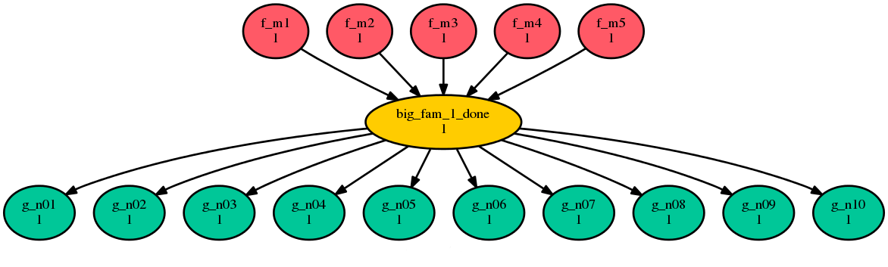

.. _Efficiency And Maintainability:

Efficiency And Maintainability
==============================

Efficiency (in the sense of *economy of suite definition*) and
maintainability go hand in hand. This section describes techniques for clean
and efficient construction of complex workflows that are easy to understand,
maintain, and modify.

.. _The Task Family Hierarchy:

The Task Family Hierarchy
-------------------------

A properly designed family hierarchy fulfils three purposes in Cylc:

- efficient sharing of all configuration common to groups of related
  tasks
- efficient bulk triggering, for clear scheduling graphs
- clean suite visualization and monitoring, because families are
  collapsible in the GUIs

.. _Sharing By Inheritance:

Sharing By Inheritance
^^^^^^^^^^^^^^^^^^^^^^

Duplication is a maintenance risk because changes have to be repeated in
multiple places without mistakes. On the other hand, unnecessary sharing of
items via global variables is also bad because it is hard to be sure which
tasks are using which variables. A properly designed runtime inheritance
hierarchy can give every task exactly what it needs, and nothing that it
doesn't need.

If a group of related tasks has some configuration in common, it can be
factored out into a task family inherited by all.

.. code-block:: cylc

   [runtime]
       [[OBSPROC]]
           # Settings common to all obs processing tasks.
       [[obs1]]
           inherit = OBSPROC
       [[obs2]]
           inherit = OBSPROC

If several families have settings in common, they can in turn can inherit
from higher-level families. 

Multiple inheritance allows efficient sharing even for overlapping categories
of tasks. For example consider that some obs processing tasks in the following
suite run parallel jobs and some serial:

.. code-block:: cylc

   [runtime]
       [[SERIAL]]
           # Serial job settings.
       [[PARALLEL]]
           # Parallel job settings.
       [[OBSPROC]]
           # Settings for all obs processing tasks.
       [[obs1, obs2, obs3]]
           # Serial obs processing tasks.
           inherit = OBSPROC, SERIAL
       [[obs4, obs5]]
           # Parallel obs processing tasks.
           inherit = OBSPROC, PARALLEL

Note that suite parameters should really be used to define family members
efficiently - see :ref:`Generating Tasks`.

Cylc provides tools to help make sense of your inheritance hierarchy:

- ``cylc graph -n/--namespaces`` - plot the full multiple
  inheritance graph (not the dependency graph)
- ``cylc get-config SUITE`` - print selected sections or items
  after inheritance processing
- ``cylc graph SUITE`` - plot the dependency graph, with
  collapsible first-parent families
  (see :ref:`Task Families And Visualization`)
- ``cylc list -t/--tree SUITE`` - print the first-parent
  inheritance hierarchy
- ``cylc list -m/--mro SUITE`` - print the inheritance
  precedence order for each runtime namespace

Family Triggering
^^^^^^^^^^^^^^^^^

Task families can be used to simplify the scheduling graph wherever many
tasks need to trigger at once:

.. code-block:: cylc

   [scheduling]
       [[dependencies]]
           graph = pre => MODELS
   [runtime]
       [[MODELS]]
       [[model1, model2, model3, ...]]
           inherit = MODELS

To trigger *off of* many tasks at once, family names need to be qualified
by ``<state>-all`` or ``<state>-any`` to indicate the desired
member-triggering semantics:

.. code-block:: cylc

   [scheduling]
       [[dependencies]]
           graph = """pre => MODELS
                   MODELS:succeed-all => post"""

Note that this can be simplified further because Cylc ignores trigger
qualifiers like ``:succeed-all`` on the right of trigger arrows
to allow chaining of dependencies:

.. code-block:: cylc

   [scheduling]
       [[dependencies]]
           graph = pre => MODELS:succeed-all => post

Family-to-Family Triggering
^^^^^^^^^^^^^^^^^^^^^^^^^^^

.. code-block:: cylc

   [scheduling]
       [[dependencies]]
           graph = BIG_FAM_1:succeed-all => BIG_FAM_2

This means every member of ``BIG_FAM_2`` depends on every member
of ``BIG_FAM_1`` succeeding. For very large families this can create so
many dependencies that it affects the performance of Cylc at run time, as
well as cluttering graph visualizations with unnecessary edges. Instead,
interpose a dummy task that signifies completion of the first family:

.. code-block:: cylc

   [scheduling]
       [[dependencies]]
           graph = BIG_FAM_1:succeed-all => big_fam_1_done => BIG_FAM_2

For families with ``M`` and ``N`` members respectively, this 
reduces the number of dependencies from ``M*N`` to ``M+N``
without affecting the scheduling.

.. _Task Families And Visualization:

Task Families And Visualization
^^^^^^^^^^^^^^^^^^^^^^^^^^^^^^^

*First parents* in the inheritance hierarchy double as collapsible summary
groups for visualization and monitoring. Tasks should generally be grouped into
visualization families that reflect their logical purpose in the suite rather
than technical detail such as inherited job submission or host settings. So in
the example under :ref:`Sharing By Inheritance` above all
``obs<n>`` tasks collapse into ``OBSPROC`` but not into
``SERIAL`` or ``PARALLEL``.

If necessary you can introduce new namespaces just for visualization:

.. code-block:: cylc

   [runtime]
       [[MODEL]]
           # (No settings here - just for visualization).
       [[model1, model2]]
           inherit = MODEL, HOSTX
       [[model3, model4]]
           inherit = MODEL, HOSTY

To stop a solo parent being used in visualization, demote it to secondary with
a null parent like this:

.. code-block:: cylc

   [runtime]
       [[SERIAL]]
       [[foo]]
           # Inherit settings from SERIAL but don't use it in visualization.
           inherit = None, SERIAL

.. _Generating Tasks:

Generating Tasks Automatically
------------------------------

Groups of tasks that are closely related such as an ensemble of model runs or
a family of obs processing tasks, or sections of workflow that are repeated
with minor variations, can be generated automatically by iterating over
some integer range (e.g. ``model<n>`` for ``n = 1..10``) or
list of strings (e.g. ``obs<type>`` for
``type = ship, buoy, radiosonde, ...``).

Jinja2 Loops
^^^^^^^^^^^^

Task generation was traditionally done in Cylc with explicit Jinja2 loops,
like this:

.. code-block:: cylc

   # Task generation the old way: Jinja2 loops (NO LONGER RECOMMENDED!)
   
   [scheduling]
       [[dependencies]]
           graph = """
   
         pre => model_p{{P}} => post
         
             model_p{{P}} => check
         
       """
   [runtime]
   
       [[model_p{{P}}]]
           script = echo "my parameter value is {{P}}"
       
           # special case...
       
   

Unfortunately this makes a mess of the suite definition, particularly the
scheduling graph, and it gets worse with nested loops over multiple parameters.

.. image:: ../graphics/png/orig/param-1.png

.. _SDG Parameterized Tasks:

Parameterized Tasks
^^^^^^^^^^^^^^^^^^^

Cylc-6.11 introduced built-in *suite parameters* for generating tasks
without destroying the clarity of the base suite definition. Here's the same
example using suite parameters instead of Jinja2 loops:

.. code-block:: cylc

   # Task generation the new way: suite parameters.
   [cylc]
       [[parameters]]
           p = 1..10
   [scheduling]
       [[dependencies]]
           graph = """pre => model
 => post
                   model<p=5> => check"""
   [runtime]
       [[model
]]
           script = echo "my parameter value is ${CYLC_TASK_PARAM_p}"
       [[model<p=7>]]
           # special case ...

Here ``model
`` expands to ``model_p7`` for ``p=7``,
and so on, via the default expansion template for integer-valued parameters,
but custom templates can be defined if necessary. Parameters can also be
defined as lists of strings, and you can define dependencies between different
values: ``chunk<p-1> => chunk
``.  Here's a multi-parameter example:

.. code-block:: cylc

   [cylc]
       [[parameters]]
           run = a, b, c
           m = 1..5
   [scheduling]
       [[dependencies]]
           graph = pre => init<run> => sim<run,m> => close<run> => post
   [runtime]
       [[sim<run,m>]]

.. image:: ../graphics/png/orig/param-2.png

If family members are defined by suite parameters, then parameterized
trigger expressions are equivalent to family ``:<state>-all`` triggers.
For example, this:

.. code-block:: cylc

   [cylc]
       [[parameters]]
           n = 1..5
   [scheduling]
       [[dependencies]]
           graph = pre => model<n> => post
   [runtime]
       [[MODELS]]
       [[model<n>]]
           inherit = MODELS

is equivalent to this:

.. code-block:: cylc

   [cylc]
       [[parameters]]
           n = 1..5
   [scheduling]
       [[dependencies]]
           graph = pre => MODELS:succeed-all => post
   [runtime]
       [[MODELS]]
       [[model<n>]]
           inherit = MODELS

(but future plans for family triggering may make the second case more
efficient for very large families).

For more information on parameterized tasks see the Cylc user guide.

.. _Optional App Config Files:

Optional App Config Files
-------------------------

Closely related tasks with few configuration differences between them - such as
multiple UM forecast and reconfiguration apps in the same suite - should use
the same Rose app configuration with the differences supplied by optional
configs, rather than duplicating the entire app for each task.

Optional app configs should be valid on top of the main app config and not
dependent on the use of other optional app configs. This ensures they will
work correctly with macros and can therefore be upgraded automatically.

.. note::

   Currently optional configs don't work very well with UM STASH
   configuration - see :ref:`UM STASH in Optional App Configs`.

Optional app configs can be loaded by command line switch:

.. code-block:: bash

   rose task-run -O key1 -O key2

or by environment variable:

.. code-block:: bash

   ROSE_APP_OPT_CONF_KEYS = key1 key2

The environment variable is generally preferred in suites because you don't
have to repeat and override the root-level script configuration: 

.. code-block:: cylc

   [runtime]
       [[root]]
           script = rose task-run -v
       [[foo]]
           [[[environment]]]
               ROSE_APP_OPT_CONF_KEYS = key1 key2
