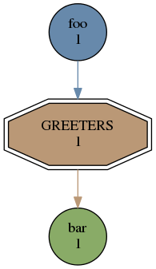
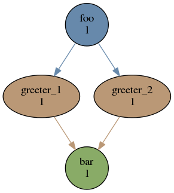
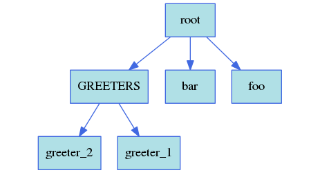
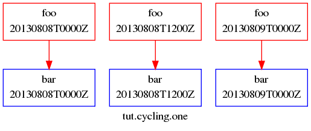
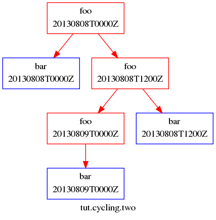
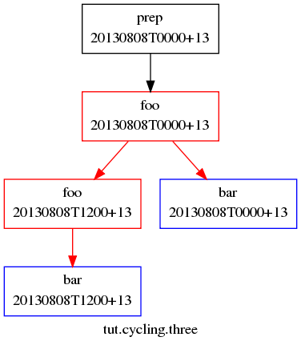
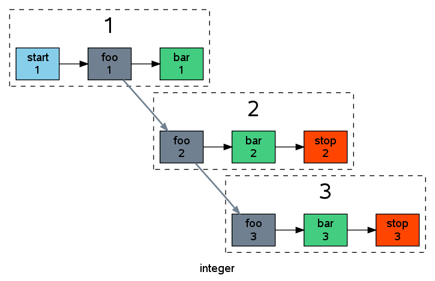

.. _Tutorial:

Tutorial
========

This section provides a hands-on tutorial introduction to basic cylc
functionality.

User Config File
----------------

Some settings affecting cylc's behaviour can be defined in site and user
*global config files*. For example, to choose the text editor invoked by
cylc on suite configurations:

.. code-block:: cylc

   # $HOME/.cylc/$(cylc --version)/global.rc
   [editors]
       terminal = vim
       gui = gvim -f

- For more on site and user global config files
  see :ref:`SiteAndUserConfiguration` and :ref:`SiteRCReference`.

.. _Configure Environment on Job Hosts:

Configure Environment on Job Hosts
^^^^^^^^^^^^^^^^^^^^^^^^^^^^^^^^^^

See :ref:`Configure Site Environment on Job Hosts` for information.

.. _CUI:

User Interfaces
---------------

You should have access to the cylc command line (CLI) and graphical (GUI) user
interfaces once cylc has been installed as described in
Section :ref:`InstallCylc`.

Command Line Interface (CLI)
^^^^^^^^^^^^^^^^^^^^^^^^^^^^

The command line interface is unified under a single top level
``cylc`` command that provides access to many sub-commands
and their help documentation.

.. code-block:: bash

   $ cylc help       # Top level command help.
   $ cylc run --help # Example command-specific help.

Command help transcripts are printed in :ref:`CommandReference` and are
available from the GUI Help menu.

Cylc is *scriptable* - the error status returned by commands can be
relied on.

Graphical User Interface (GUI)
^^^^^^^^^^^^^^^^^^^^^^^^^^^^^^

The cylc GUI covers the same functionality as the CLI, but it has more
sophisticated suite monitoring capability. It can start and stop suites, or
connect to suites that are already running; in either case, shutting down the
GUI does not affect the suite itself.

.. code-block:: bash

   $ gcylc & # or:
   $ cylc gui & # Single suite control GUI.
   $ cylc gscan & # Multi-suite monitor GUI.

Clicking on a suite in gscan, shown in :numref:`fig-gscan`, opens a
gcylc instance for it.

Suite Configuration
-------------------

Cylc suites are defined by extended-INI format ``suite.rc``
files (the main file format extension is section nesting). These reside
in *suite configuration directories* that may also contain a
``bin`` directory and any other suite-related files.

- For more on the suite configuration file format, see :ref:`SuiteDefinition`
  and :ref:`SuiteRCReference`.

Suite Registration
------------------

Suite registration creates a run directory (under ``~/cylc-run/`` by
default) and populates it with authentication files and a symbolic link to a
suite configuration directory. Cylc commands that parse suites can take
the file path or the suite name as input. Commands that interact with running
suites have to target the suite by name.

.. code-block:: bash

   # Target a suite by file path:
   $ cylc validate /path/to/my/suite/suite.rc
   $ cylc graph /path/to/my/suite/suite.rc

   # Register a suite:
   $ cylc register my.suite /path/to/my/suite/

   # Target a suite by name:
   $ cylc graph my.suite
   $ cylc validate my.suite
   $ cylc run my.suite
   $ cylc stop my.suite
   # etc.

.. _tutPassphrases:

Suite Passphrases
-----------------

Registration (above) also generates a suite-specific passphrase file under
``.service/`` in the suite run directory. It is loaded by the suite
server program at start-up and used to authenticate connections from client
programs.

Possession of a suite's passphrase file gives full control over it.
Without it, the information available to a client is determined by the suite's
public access privilege level.

For more on connection authentication, suite passphrases, and public access,
see :ref:`ConnectionAuthentication`.

.. _ImportTheExampleSuites:

Import The Example Suites
-------------------------

Run the following command to copy cylc's example suites and register them for
your own use:

.. code-block:: bash

   $ cylc import-examples /tmp

Rename The Imported Tutorial Suites
-----------------------------------

Suites can be renamed by simply renaming (i.e. moving) their run directories.
Make the tutorial suite names shorter, and print their locations with
``cylc print``:

.. code-block:: bash

   $ mv ~/cylc-run/examples/$(cylc --version)/tutorial ~/cylc-run/tut
   $ cylc print -ya tut
   tut/oneoff/jinja2  | /tmp/cylc-examples/7.0.0/tutorial/oneoff/jinja2
   tut/cycling/two    | /tmp/cylc-examples/7.0.0/tutorial/cycling/two
   tut/cycling/three  | /tmp/cylc-examples/7.0.0/tutorial/cycling/three
   # ...

See ``cylc print --help`` for other display options.

Suite Validation
----------------

Suite configurations can be validated to detect syntax (and other) errors:

.. code-block:: bash

   # pass:
   $ cylc validate tut/oneoff/basic
   Valid for cylc-6.0.0
   $ echo $?
   0
   # fail:
   $ cylc validate my/bad/suite
   Illegal item: [scheduling]special tusks
   $ echo $?
   1

Hello World in Cylc
-------------------

**suite**: ``tut/oneoff/basic``

Here's the traditional *Hello World* program rendered as a cylc
suite:

.. literalinclude:: ../../etc/examples/tutorial/oneoff/basic/suite.rc
   :language: cylc

Cylc suites feature a clean separation of scheduling configuration,
which determines *when* tasks are ready to run; and runtime
configuration, which determines *what* to run (and *where* and
*how* to run it) when a task is ready. In this example the
``[scheduling]`` section defines a single task called
``hello`` that triggers immediately when the suite starts
up. When the task finishes the suite shuts down. That this is a
*dependency graph* will be more obvious when more tasks are added.
Under the ``[runtime]`` section the
``script`` item defines a simple inlined
implementation for ``hello``: it sleeps for ten seconds,
then prints ``Hello World!``, and exits. This ends up in a *job script*
generated by cylc to encapsulate the task (below) and,
thanks to some defaults designed to allow quick
prototyping of new suites, it is submitted to run as a background job on
the suite host. In fact cylc even provides a default task implementation
that makes the entire ``[runtime]`` section technically optional:

.. literalinclude:: ../../etc/examples/tutorial/oneoff/minimal/suite.rc
   :language: cylc

(the resulting *dummy task* just prints out some identifying
information and exits).

Editing Suites
--------------

The text editor invoked by Cylc on suite configurations is determined
by cylc site and user global config files, as shown above in :ref:`CUI`.
Check that you have renamed the tutorial examples suites as described
just above and open the *Hello World* suite in your text editor:

.. code-block:: bash

   $ cylc edit tut/oneoff/basic # in-terminal
   $ cylc edit -g tut/oneoff/basic & # or GUI

Alternatively, start gcylc on the suite:

.. code-block:: bash

   $ gcylc tut/oneoff/basic &

and choose *Suite* ``->`` *Edit* from the menu.

The editor will be invoked from within the suite configuration directory
for easy access to other suite files (in this case there are none). There are
syntax highlighting control files for several text editors under
``<cylc-dir>/etc/syntax/``; see in-file comments for installation
instructions.

.. _RunningSuitesCLI:

Running Suites
--------------

CLI
^^^

Run ``tut/oneoff/basic`` using the ``cylc run`` command.
As a suite runs detailed timestamped information is written to a *suite log*
and progress can be followed with cylc's suite monitoring tools (below).
By default a suite server program daemonizes after printing a short message so
that you can exit the terminal or even log out without killing the suite:

.. code-block:: bash

   $ cylc run tut/oneoff/basic
               ._.
               | |                 The Cylc Suite Engine [7.0.0]
   ._____._. ._| |_____.           Copyright (C) NIWA & British Crown (Met Office) & Contributors.
   | .___| | | | | .___|  _ _ _ _ _ _ _ _ _ _ _ _ _ _ _ _ _ _ _ _ _ _ _ _
   | !___| !_! | | !___.  This program comes with ABSOLUTELY NO WARRANTY;
   !_____!___. |_!_____!  see `cylc warranty`.  It is free software, you
         .___! |           are welcome to redistribute it under certain
         !_____!                conditions; see `cylc conditions`.

   *** listening on https://nwp-1:43027/ ***

   To view suite server program contact information:
    $ cylc get-suite-contact tut/oneoff/basic

   Other ways to see if the suite is still running:
    $ cylc scan -n '\btut/oneoff/basic\b' nwp-1
    $ cylc ping -v --host=nwp-1 tut/oneoff/basic
    $ ps h -opid,args 123456  # on nwp-1

If you're quick enough (this example only takes 10-15 seconds to run) the
``cylc scan`` command will detect the running suite:

.. code-block:: bash

   $ cylc scan
   tut/oneoff/basic oliverh@nwp-1:43027

.. note::

   You can use the ``--no-detach`` and ``--debug`` options
   to ``cylc-run`` to prevent the suite from daemonizing (i.e. to make
   it stay attached to your terminal until it exits).

When a task is ready cylc generates a *job script* to run it, by
default as a background jobs on the suite host.  The job process ID is
captured, and job output is directed to log files in standard
locations under the suite run directory.

Log file locations relative to the suite run directory look like
``job/1/hello/01/`` where the first digit is the *cycle point* of
the task ``hello`` (for non-cycling tasks this is just ``1``); and the
final ``01`` is the *submit number* (so that job logs do not get
overwritten if a job is resubmitted for any reason).

The suite shuts down automatically once all tasks have succeeded.

GUI
^^^

The cylc GUI can start and stop suites, or (re)connect to suites that
are already running:

.. code-block:: bash

   $ cylc gui tut/oneoff/basic &

Use the tool bar *Play* button, or the *Control* ``->`` *Run* menu item, to
run the suite again. You may want to alter the suite configuration slightly
to make the task take longer to run. Try right-clicking on the
``hello`` task to view its output logs. The relative merits of the three
*suite views* - dot, text, and graph - will be more apparent later when we
have more tasks. Closing the GUI does not affect the suite itself.

.. _RemoteSuites:

Remote Suites
-------------

Suites can run on *localhost* or on a *remote* host.

To start up a suite on a given host, specify it explicitly via the
``--host=`` option to a ``run`` or ``restart`` command.

Otherwise, Cylc selects the best host to start up on from allowed
``run hosts`` as specified in the global config under
``[suite servers]``, which defaults to localhost. Should there be
more than one allowed host set, the *most suitable* is determined
according to the settings specified under ``[[run host select]]``,
namely exclusion of hosts not meeting suitability *thresholds*, if
provided, then ranking according to the given *rank* method.

Discovering Running Suites
--------------------------

Suites that are currently running can be detected with command line or
GUI tools:

.. code-block:: bash

   # list currently running suites and their port numbers:
   $ cylc scan
   tut/oneoff/basic oliverh@nwp-1:43001

   # GUI summary view of running suites:
   $ cylc gscan &

The scan GUI is shown in :numref:`fig-gscan`; clicking on a suite in
it opens gcylc.

.. _TaskIdentifiers:

Task Identifiers
----------------

At run time, task instances are identified by their *name* (see
:ref:`TaskNames`), which is determined entirely by the suite configuration,
and a *cycle point* which is usually a date-time or an integer:

.. code-block:: bash

   foo.20100808T00Z   # a task with a date-time cycle point
   bar.1              # a task with an integer cycle point (could be non-cycling)

Non-cycling tasks usually just have the cycle point ``1``, but this
still has to be used to target the task instance with cylc commands.

Job Submission: How Tasks Are Executed
--------------------------------------

**suite**: ``tut/oneoff/jobsub``

Task *job scripts* are generated by cylc to wrap the task implementation
specified in the suite configuration (environment, script, etc.) in
error trapping code, messaging calls to report task progress back to the suite
server program, and so forth. Job scripts are written to the *suite job log
directory* where they can be viewed alongside the job output logs. They
can be accessed at run time by right-clicking on the task in the cylc GUI, or
printed to the terminal:

.. code-block:: bash

   $ cylc cat-log tut/oneoff/basic hello.1

This command can also print the suite log (and stdout and stderr for suites
in daemon mode) and task stdout and stderr logs (see
``cylc cat-log --help``).

A new job script can also be generated on the fly for inspection:

.. code-block:: bash

   $ cylc jobscript tut/oneoff/basic hello.1

Take a look at the job script generated for ``hello.1`` during
the suite run above. The custom scripting should be clearly visible
toward the bottom of the file.

The ``hello`` task in the first tutorial suite defaults to
running as a background job on the suite host. To submit it to the Unix
``at`` scheduler instead, configure its job submission settings
as in ``tut/oneoff/jobsub``:

.. code-block:: cylc

   [runtime]
       [[hello]]
           script = "sleep 10; echo Hello World!"
           [[[job]]]
               batch system = at

Run the suite again after checking that ``at`` is running on your
system.

Cylc supports a number of different batch systems. Tasks
submitted to external batch queuing systems like ``at``,
``PBS``, ``SLURM``, ``Moab``, or ``LoadLeveler``, are displayed as
*submitted* in the cylc GUI until they start executing.

- For more on task job scripts, see :ref:`JobScripts`.
- For more on batch systems, see :ref:`AvailableMethods`.

Locating Suite And Task Output
------------------------------

If the ``--no-detach`` option is not used, suite stdout and
stderr will be directed to the suite run directory along with the
time-stamped suite log file, and task job scripts and job logs
(task stdout and stderr). The default suite run directory location is
``$HOME/cylc-run``:

.. code-block:: bash

   $ tree $HOME/cylc-run/tut/oneoff/basic/
   |-- .service              # location of run time service files
   |    |-- contact          # detail on how to contact the running suite
   |    |-- db               # private suite run database
   |    |-- passphrase       # passphrase for client authentication
   |    |-- source           # symbolic link to source directory
   |    |-- ssl.cert         # SSL certificate for the suite server
   |    `-- ssl.pem          # SSL private key
   |-- cylc-suite.db         # back compat symlink to public suite run database
   |-- share                 # suite share directory (not used in this example)
   |-- work                  # task work space (sub-dirs are deleted if not used)
   |    `-- 1                   # task cycle point directory (or 1)
   |        `-- hello              # task work directory (deleted if not used)
   |-- log                   # suite log directory
   |   |-- db                   # public suite run database
   |   |-- job                  # task job log directory
   |   |   `-- 1                   # task cycle point directory (or 1)
   |   |       `-- hello              # task name
   |   |           |-- 01                # task submission number
   |   |           |   |-- job              # task job script
   |   |           |   `-- job-activity.log # task job activity log
   |   |           |   |-- job.err          # task stderr log
   |   |           |   |-- job.out          # task stdout log
   |   |           |   `-- job.status       # task status file
   |   |           `-- NN -> 01          # symlink to latest submission number
   |   `-- suite                # suite server log directory
   |       |-- err                 # suite server stderr log (daemon mode only)
   |       |-- out                 # suite server stdout log (daemon mode only)
   |       `-- log                 # suite server event log (timestamped info)

The suite run database files, suite environment file,
and task status files are used internally by cylc. Tasks execute in
private ``work/`` directories that are deleted automatically
if empty when the task finishes. The suite
``share/`` directory is made available to all tasks (by
``$CYLC_SUITE_SHARE_DIR``) as a common share space. The task submission
number increments from ``1`` if a task retries; this is used as a
sub-directory of the log tree to avoid overwriting log files from earlier
job submissions.

The top level run directory location can be changed in site and user
config files if necessary, and the suite share and work locations can be
configured separately because of the potentially larger disk space
requirement.

Task job logs can be viewed by right-clicking on tasks in the gcylc
GUI (so long as the task proxy is live in the suite), manually
accessed from the log directory (of course), or printed to the terminal
with the ``cylc cat-log`` command:

.. code-block:: bash

   # suite logs:
   $ cylc cat-log    tut/oneoff/basic           # suite event log
   $ cylc cat-log -o tut/oneoff/basic           # suite stdout log
   $ cylc cat-log -e tut/oneoff/basic           # suite stderr log
   # task logs:
   $ cylc cat-log    tut/oneoff/basic hello.1   # task job script
   $ cylc cat-log -o tut/oneoff/basic hello.1   # task stdout log
   $ cylc cat-log -e tut/oneoff/basic hello.1   # task stderr log

- For a web-based interface to suite and task logs (and much more),
  see *Rose* in :ref:`SuiteStorageEtc`.
- For more on environment variables supplied to tasks, such as
  ``$CYLC_SUITE_SHARE_DIR``, see :ref:`TaskExecutionEnvironment`.

.. _ViewingSuiteLogsCylcReview:

Viewing Suite Logs in a Web Browser: Cylc Review
------------------------------------------------

The Cylc Review web service displays suite job logs and other information in
web pages, as shown in :numref:`fig-review-screenshot`. It can run under a
WSGI server (e.g. Apache with ``mod_wsgi``) as a service for all
users, or as an ad hoc service under your own user account.

If a central Cylc Review service has been set up at your site (e.g. as
described in :ref:`ConfiguringCylcReviewApache`) the URL will typically be
something like ``http://<server>/cylc-review/``.

.. _fig-review-screenshot:

.. figure:: graphics/png/orig/cylc-review-screenshot.png
   :align: center

   Screenshot of a Cylc Review web page

Otherwise, to start an ad hoc Cylc Review service to view your own suite logs
(or those of others, if you have read access to them), run:

.. code-block:: none

   setsid cylc review start 0</dev/null 1>/dev/null 2>&1 &

The service should start at ``http://<server>:8080`` (the port number
can optionally be set on the command line). Service logs are written to
``~/.cylc/cylc-review*``. Run ``cylc review`` to view
status information, and ``cylc review stop`` to stop the service.

.. _RemoteTasks:

Remote Tasks
------------

**suite**: ``tut/oneoff/remote``

The ``hello`` task in the first two tutorial suites defaults to
running on the suite host :ref:`RemoteSuites`. To make it run on a different
host instead change its runtime configuration as in ``tut/oneoff/remote``:

.. code-block:: cylc

   [runtime]
       [[hello]]
           script = "sleep 10; echo Hello World!"
           [[[remote]]]
               host = server1.niwa.co.nz

In general, a *task remote* is a user account, other than the account
running the suite server program, where a task job is submitted to run. It can
be on the same machine running the suite or on another machine.

A task remote account must satisfy several requirements:

- Non-interactive ssh must be enabled from the account running the suite
  server program to the account for submitting (and managing) the remote
  task job.
- Network settings must allow communication *back* from the remote task
  job to the suite, either by network ports or ssh, unless the last-resort one
  way *task polling* communication method is used.
- Cylc must be installed and runnable on the task remote account. Other
  software dependencies like graphviz are not required there.
- Any files needed by a remote task must be installed on the task
  host. In this example there is nothing to install because the
  implementation of ``hello`` is inlined in the suite configuration
  and thus ends up entirely contained within the task job script.

If your username is different on the task host, you can add a ``User``
setting for the relevant host in your ``~/.ssh/config``.
If you are unable to do so, the ``[[[remote]]]`` section also supports an
``owner=username`` item.

If you configure a task account according to the requirements cylc will invoke
itself on the remote account (with a login shell by default) to create log
directories, transfer any essential service files, send the task job script
over, and submit it to run there by the configured batch system.

Remote task job logs are saved to the suite run directory on the task remote,
not on the account running the suite. They can be retrieved by right-clicking
on the task in the GUI, or to have cylc pull them back to the suite account
automatically do this:

.. code-block:: cylc

   [runtime]
       [[hello]]
           script = "sleep 10; echo Hello World!"
           [[[remote]]]
               host = server1.niwa.co.nz
               retrieve job logs = True

This suite will attempt to ``rsync`` job logs from the remote
host each time a task job completes.

Some batch systems have considerable delays between the time when the job
completes and when it writes the job logs in its normal location. If this is
the case, you can configure an initial delay and retry delays for job log
retrieval by setting some delays. E.g.:

.. code-block:: cylc

   [runtime]
       [[hello]]
           script = "sleep 10; echo Hello World!"
           [[[remote]]]
               host = server1.niwa.co.nz
               retrieve job logs = True
               # Retry after 10 seconds, 1 minute and 3 minutes
               retrieve job logs retry delays = PT10S, PT1M, PT3M

Finally, if the disk space of the suite host is limited, you may want to set
``[[[remote]]]retrieve job logs max size=SIZE``. The value of SIZE can
be anything that is accepted by the ``--max-size=SIZE`` option of the
``rsync`` command. E.g.:

.. code-block:: cylc

   [runtime]
       [[hello]]
           script = "sleep 10; echo Hello World!"
           [[[remote]]]
               host = server1.niwa.co.nz
               retrieve job logs = True
               # Don't get anything bigger than 10MB
               retrieve job logs max size = 10M

It is worth noting that cylc uses the existence of a job's ``job.out``
or ``job.err`` in the local file system to indicate a successful job
log retrieval. If ``retrieve job logs max size=SIZE`` is set and both
``job.out`` and ``job.err`` are bigger than ``SIZE``
then cylc will consider the retrieval as failed. If retry delays are specified,
this will trigger some useless (but harmless) retries. If this occurs
regularly, you should try the following:

- Reduce the verbosity of STDOUT or STDERR from the task.
- Redirect the verbosity from STDOUT or STDERR to an alternate log file.
- Adjust the size limit with tolerance to the expected size of STDOUT or
  STDERR.

- For more on remote tasks see :ref:`RunningTasksOnARemoteHost`
- For more on task communications, see :ref:`TaskComms`.
- For more on suite passphrases and authentication,
  see :ref:`tutPassphrases` and :ref:`ConnectionAuthentication`.

Task Triggering
---------------

**suite**: ``tut/oneoff/goodbye``

To make a second task called ``goodbye`` trigger after
``hello`` finishes successfully, return to the original
example, ``tut/oneoff/basic``, and change the suite graph
as in ``tut/oneoff/goodbye``:

.. code-block:: cylc

   [scheduling]
       [[dependencies]]
           graph = "hello => goodbye"

or to trigger it at the same time as ``hello``,

.. code-block:: cylc

   [scheduling]
       [[dependencies]]
           graph = "hello & goodbye"

and configure the new task's behaviour under ``[runtime]``:

.. code-block:: cylc

   [runtime]
       [[goodbye]]
           script = "sleep 10; echo Goodbye World!"

Run ``tut/oneoff/goodbye`` and check the output from the new task:

.. code-block:: bash

   $ cat ~/cylc-run/tut/oneoff/goodbye/log/job/1/goodbye/01/job.out
     # or
   $ cylc cat-log -o tut/oneoff/goodbye goodbye.1
   JOB SCRIPT STARTING
   cylc (scheduler - 2014-08-14T15:09:30+12): goodbye.1 started at 2014-08-14T15:09:30+12
   cylc Suite and Task Identity:
     Suite Name  : tut/oneoff/goodbye
     Suite Host  : oliverh-34403dl.niwa.local
     Suite Port  : 43001
     Suite Owner : oliverh
     Task ID     : goodbye.1
     Task Host   : nwp-1
     Task Owner  : oliverh
     Task Try No.: 1

   Goodbye World!
   cylc (scheduler - 2014-08-14T15:09:40+12): goodbye.1 succeeded at 2014-08-14T15:09:40+12
   JOB SCRIPT EXITING (TASK SUCCEEDED)

Task Failure And Suicide Triggering
^^^^^^^^^^^^^^^^^^^^^^^^^^^^^^^^^^^

**suite**: ``tut/oneoff/suicide``

Task names in the graph string can be qualified with a state indicator
to trigger off task states other than success:

.. code-block:: cylc

       graph = """
   a => b        # trigger b if a succeeds
   c:submit => d # trigger d if c submits
   e:finish => f # trigger f if e succeeds or fails
   g:start  => h # trigger h if g starts executing
   i:fail   => j # trigger j if i fails
               """

A common use of this is to automate recovery from known modes of failure:

.. code-block:: cylc

   graph = "goodbye:fail => really_goodbye"

i.e. if task ``goodbye`` fails, trigger another task that
(presumably) really says goodbye.

Failure triggering generally requires use of *suicide triggers* as
well, to remove the recovery task if it isn't required (otherwise it
would hang about indefinitely in the waiting state):

.. code-block:: cylc

   [scheduling]
       [[dependencies]]
           graph = """hello => goodbye
               goodbye:fail => really_goodbye
            goodbye => !really_goodbye # suicide"""

This means if ``goodbye`` fails, trigger
``really_goodbye``; and otherwise, if ``goodbye``
succeeds, remove ``really_goodbye`` from the suite.

Try running ``tut/oneoff/suicide``, which also configures
the ``hello`` task's runtime to make it fail, to see how this works.

- For more on suite dependency graphs see :ref:`ConfiguringScheduling`.
- For more on task triggering see :ref:`TriggerTypes`.

Runtime Inheritance
-------------------

**suite**: ``tut/oneoff/inherit``

The ``[runtime]`` section is actually a *multiple inheritance* hierarchy.
Each subsection is a *namespace* that represents a task, or if it is
inherited by other namespaces, a *family*. This allows common configuration
to be factored out of related tasks very efficiently.

.. literalinclude:: ../../etc/examples/tutorial/oneoff/inherit/suite.rc
   :language: cylc

The ``[root]`` namespace provides defaults for all tasks in the suite.
Here both tasks inherit ``script`` from ``root``, which they
customize with different values of the environment variable
``$GREETING``. 

.. note::

   Inheritance from ``root`` is
   implicit; from other parents an explicit ``inherit = PARENT``
   is required, as shown below.

- For more on runtime inheritance, see :ref:`NIORP`.

Triggering Families
-------------------

**suite**: ``tut/oneoff/ftrigger1``

Task families defined by runtime inheritance can also be used as
shorthand in graph trigger expressions. To see this, consider two
"greeter" tasks that trigger off another task ``foo``:

.. code-block:: cylc

   [scheduling]
       [[dependencies]]
           graph = "foo => greeter_1 & greeter_2"

If we put the common greeting functionality of ``greeter_1``
and ``greeter_2`` into a special ``GREETERS`` family,
the graph can be expressed more efficiently like this:

.. code-block:: cylc

   [scheduling]
       [[dependencies]]
           graph = "foo => GREETERS"

i.e. if ``foo`` succeeds, trigger all members of
``GREETERS`` at once. Here's the full suite with runtime
hierarchy shown:

.. literalinclude:: ../../etc/examples/tutorial/oneoff/ftrigger1/suite.rc
   :language: cylc

.. note::

   We recommend given ALL-CAPS names to task families to help
   distinguish them from task names. However, this is just a convention.

Experiment with the ``tut/oneoff/ftrigger1`` suite to see
how this works.

Triggering Off Of Families
--------------------------

**suite**: ``tut/oneoff/ftrigger2``

Tasks (or families) can also trigger *off* other families, but
in this case we need to specify what the trigger means in terms of
the upstream family members. Here's how to trigger another task
``bar`` if all members of ``GREETERS`` succeed:

.. code-block:: cylc

   [scheduling]
       [[dependencies]]
           graph = """foo => GREETERS
               GREETERS:succeed-all => bar"""

Verbose validation in this case reports:

.. code-block:: bash

   $ cylc val -v tut/oneoff/ftrigger2
   ...
   Graph line substitutions occurred:
     IN: GREETERS:succeed-all => bar
     OUT: greeter_1:succeed & greeter_2:succeed => bar
   ...

Cylc ignores family member qualifiers like ``succeed-all`` on
the right side of a trigger arrow, where they don't make sense, to
allow the two graph lines above to be combined in simple cases:

.. code-block:: cylc

   [scheduling]
       [[dependencies]]
           graph = "foo => GREETERS:succeed-all => bar"

Any task triggering status qualified by ``-all`` or
``-any``, for the members, can be used with a family trigger.
For example, here's how to trigger ``bar`` if all members
of ``GREETERS`` finish (succeed or fail) and any of them succeed:

.. code-block:: cylc

   [scheduling]
       [[dependencies]]
           graph = """foo => GREETERS
       GREETERS:finish-all & GREETERS:succeed-any => bar"""

(use of ``GREETERS:succeed-any`` by itself here would trigger
``bar`` as soon as any one member of ``GREETERS``
completed successfully). Verbose validation now begins to show how
family triggers can simplify complex graphs, even for this tiny
two-member family:

.. code-block:: bash

   $ cylc val -v tut/oneoff/ftrigger2
   ...
   Graph line substitutions occurred:
     IN: GREETERS:finish-all & GREETERS:succeed-any => bar
     OUT: ( greeter_1:succeed | greeter_1:fail ) & \
          ( greeter_2:succeed | greeter_2:fail ) & \
          ( greeter_1:succeed | greeter_2:succeed ) => bar
   ...

Experiment with ``tut/oneoff/ftrigger2`` to see how this works.

- For more on family triggering, see :ref:`FamilyTriggers`.

Suite Visualization
-------------------

You can style dependency graphs with an optional
``[visualization]`` section, as shown in ``tut/oneoff/ftrigger2``:

.. code-block:: cylc

   [visualization]
       default node attributes = "style=filled"
       [[node attributes]]
           foo = "fillcolor=#6789ab", "color=magenta"
           GREETERS = "fillcolor=#ba9876"
           bar = "fillcolor=#89ab67"

To display the graph in an interactive viewer:

.. code-block:: bash

   $ cylc graph tut/oneoff/ftrigger2 &    # dependency graph
   $ cylc graph -n tut/oneoff/ftrigger2 & # runtime inheritance graph

It should look like :numref:`fig-tut-hello-multi` (with the
``GREETERS`` family node expanded on the right).

.. todo::
   Create sub-figures if possible: for now hacked as separate figures with
   link to first, and caption on final, displayed figure.

.. _fig-tut-hello-multi:

   The ``tut/oneoff/ftrigger2`` dependency and runtime inheritance graphs

Graph styling can be applied to entire families at once, and custom
"node groups" can also be defined for non-family groups.

External Task Scripts
---------------------

**suite**: ``tut/oneoff/external``

The tasks in our examples so far have all had inlined implementation, in
the suite configuration, but real tasks often need to call external
commands, scripts, or executables. To try this, let's return to the
basic Hello World suite and cut the implementation of the task
``hello`` out to a file ``hello.sh`` in the suite bin directory:

.. literalinclude:: ../../etc/examples/tutorial/oneoff/external/bin/hello.sh
   :language: bash

Make the task script executable, and change the ``hello`` task
runtime section to invoke it:

.. literalinclude:: ../../etc/examples/tutorial/oneoff/external/suite.rc
   :language: cylc

If you run the suite now the new greeting from the external task script
should appear in the ``hello`` task stdout log. This works
because cylc automatically adds the suite bin directory to
``$PATH`` in the environment passed to tasks via their job
scripts. To execute scripts (etc.) located elsewhere you can
refer to the file by its full file path, or set ``$PATH``
appropriately yourself (this could be done via
``$HOME/.profile``, which is sourced at the top of the task job
script, or in the suite configuration itself).

.. note::

   The use of ``set -e`` above to make the script abort on
   error. This allows the error trapping code in the task job script to
   automatically detect unforeseen errors.

Cycling Tasks
-------------

**suite**: ``tut/cycling/one``

So far we've considered non-cycling tasks, which finish without spawning
a successor.

Cycling is based around iterating through date-time or integer sequences. A
cycling task may run at each cycle point in a given sequence (cycle). For
example, a sequence might be a set of date-times every 6 hours starting from a
particular date-time. A cycling task may run for each date-time item (cycle
point) in that sequence.

There may be multiple instances of this type of task running in parallel, if
the opportunity arises and their dependencies allow it. Alternatively, a
sequence can be defined with only one valid cycle point - in that case, a task
belonging to that sequence may only run once.

Open the ``tut/cycling/one`` suite:

.. literalinclude:: ../../etc/examples/tutorial/cycling/one/suite.rc
   :language: cylc

The difference between cycling and non-cycling suites is all in the
``[scheduling]`` section, so we will leave the
``[runtime]`` section alone for now (this will result in
cycling dummy tasks).

.. note::

   The graph is now defined under a new section heading that makes each
   task under it have a succession of cycle points ending in ``00`` or
   ``12`` hours, between specified initial and final cycle
   points (or indefinitely if no final cycle point is given), as shown in
   :numref:`fig-tut-one`.

.. todo::
   Image out of date now.

.. _fig-tut-one:

   The ``tut/cycling/one`` suite

If you run this suite instances of ``foo`` will spawn in parallel out
to the *runahead limit*, and each ``bar`` will trigger off the
corresponding instance of ``foo`` at the same cycle point. The
runahead limit, which defaults to a few cycles but is configurable, prevents
uncontrolled spawning of cycling tasks in suites that are not constrained by
clock triggers in real time operation.

Experiment with ``tut/cycling/one`` to see how cycling tasks work.

ISO 8601 Date-Time Syntax
^^^^^^^^^^^^^^^^^^^^^^^^^

The suite above is a very simple example of a cycling date-time workflow. More
generally, cylc comprehensively supports the ISO 8601 standard for date-time
instants, intervals, and sequences. Cycling graph sections can be specified
using full ISO 8601 recurrence expressions, but these may be simplified
by assuming context information from the suite - namely initial and final cycle
points. One form of the recurrence syntax looks like
``Rn/start-date-time/period`` (``Rn`` means run ``n`` times). In the example
above, if the initial cycle point
is always at ``00`` or ``12`` hours then ``[[[T00,T12]]]`` could be
written as ``[[[PT12H]]]``, which is short for
``[[[R/initial-cycle-point/PT12H/]]]`` - i.e. run every 12 hours
indefinitely starting at the initial cycle point. It is possible to add
constraints to the suite to only allow initial cycle points at ``00`` or
``12`` hours e.g.

.. code-block:: cylc

   [scheduling]
       initial cycle point = 20130808T00
       initial cycle point constraints = T00, T12

.. todo::
   Runahead factor now.

- For a comprehensive description of ISO 8601 based date-time cycling,
  see :ref:`AdvancedCycling`
- For more on runahead limiting in cycling suites,
  see :ref:`RunaheadLimit`.

.. _TutInterCyclePointTriggers:

Inter-Cycle Triggers
^^^^^^^^^^^^^^^^^^^^

**suite**: ``tut/cycling/two``

The ``tut/cycling/two`` suite adds inter-cycle dependence
to the previous example:

.. code-block:: cylc

   [scheduling]
       [[dependencies]]
           # Repeat with cycle points of 00 and 12 hours every day:
           [[[T00,T12]]]
               graph = "foo[-PT12H] => foo => bar"

For any given cycle point in the sequence defined by the
cycling graph section heading, ``bar`` triggers off
``foo`` as before, but now ``foo`` triggers off its own
previous instance ``foo[-PT12H]``. Date-time offsets in
inter-cycle triggers are expressed as ISO 8601 intervals (12 hours
in this case). :numref:`fig-tut-two` shows how this connects the
cycling graph sections together.

.. _fig-tut-two:

   The ``tut/cycling/two`` suite

Experiment with this suite to see how inter-cycle triggers work.

.. note::

   The first instance of ``foo``, at suite start-up, will
   trigger immediately in spite of its inter-cycle trigger, because cylc
   ignores dependence on points earlier than the initial cycle point.
   However, the presence of an inter-cycle trigger usually implies something
   special has to happen at start-up. If a model depends on its own previous
   instance for restart files, for example, then some special process has to
   generate the initial set of restart files when there is no previous cycle
   point to do it. The following section shows one way to handle this
   in cylc suites.

.. _initial-non-repeating-r1-tasks:

Initial Non-Repeating (R1) Tasks
^^^^^^^^^^^^^^^^^^^^^^^^^^^^^^^^

**suite**: ``tut/cycling/three``

Sometimes we want to be able to run a task at the initial cycle point, but
refrain from running it in subsequent cycles. We can do this by writing an
extra set of dependencies that are only valid at a single date-time cycle
point. If we choose this to be the initial cycle point, these will only apply
at the very start of the suite.

The cylc syntax for writing this single date-time cycle point occurrence is
``R1``, which stands for ``R1/no-specified-date-time/no-specified-period``.
This is an adaptation of part of the ISO 8601 date-time standard's recurrence
syntax (``Rn/date-time/period``) with some special context information
supplied by cylc for the ``no-specified-*`` data.

The ``1`` in the ``R1`` means run once. As we've specified
no date-time, Cylc will use the initial cycle point date-time by default,
which is what we want. We've also missed out specifying the period - this is
set by cylc to a zero amount of time in this case (as it never
repeats, this is not significant).

For example, in ``tut/cycling/three``:

.. code-block:: cylc

   [cylc]
       cycle point time zone = +13
   [scheduling]
       initial cycle point = 20130808T00
       final cycle point = 20130812T00
       [[dependencies]]
           [[[R1]]]
               graph = "prep => foo"
           [[[T00,T12]]]
               graph = "foo[-PT12H] => foo => bar"

This is shown in :numref:`fig-tut-three`.

.. note::

   The time zone has been set to ``+1300`` in this case,
   instead of UTC (``Z``) as before. If no time zone or UTC mode was set,
   the local time zone of your machine will be used in the cycle points.

At the initial cycle point, ``foo`` will depend on ``foo[-PT12H]`` and also
on ``prep``:

.. code-block:: cylc

   prep.20130808T0000+13 & foo.20130807T1200+13 => foo.20130808T0000+13

Thereafter, it will just look like e.g.:

.. code-block:: cylc

   foo.20130808T0000+13 => foo.20130808T1200+13

However, in our initial cycle point example, the dependence on
``foo.20130807T1200+13`` will be ignored, because that task's cycle
point is earlier than the suite's initial cycle point and so it cannot run.
This means that the initial cycle point dependencies for ``foo``
actually look like:

.. code-block:: cylc

   prep.20130808T0000+13 => foo.20130808T0000+13

.. _fig-tut-three:

   The ``tut/cycling/three`` suite

- ``R1`` tasks can also be used to make something special
  happen at suite shutdown, or at any single cycle point throughout the
  suite run. For a full primer on cycling syntax, see :ref:`AdvancedCycling`.

.. _TutInteger:

Integer Cycling
^^^^^^^^^^^^^^^

**suite**: ``tut/cycling/integer``

Cylc can do also do integer cycling for repeating workflows that are not
date-time based.

Open the ``tut/cycling/integer`` suite, which is plotted in
:numref:`fig-tut-int`.

.. literalinclude:: ../../etc/examples/tutorial/cycling/integer/suite.rc
   :language: cylc

.. _fig-tut-int:

   The ``tut/cycling/integer`` suite

The integer cycling notation is intended to look similar to the ISO 8601
date-time notation, but it is simpler for obvious reasons. The example suite
illustrates two recurrence forms,
``Rn/start-point/period`` and
``Rn/period/stop-point``, simplified somewhat using suite context
information (namely the initial and final cycle points). The first form is
used to run one special task called ``start`` at start-up, and for the
main cycling body of the suite; and the second form to run another special task
called ``stop`` in the final two cycles. The ``P`` character
denotes period (interval) just like in the date-time notation.
``R/1/P2`` would generate the sequence of points ``1,3,5,...``.

- For more on integer cycling, including a more realistic usage example
  see :ref:`IntegerCycling`.

Jinja2
------

**suite**: ``tut/oneoff/jinja2``

Cylc has built in support for the Jinja2 template processor, which
allows us to embed code in suite configurations to generate the
final result seen by cylc.

The ``tut/oneoff/jinja2`` suite illustrates two common
uses of Jinja2: changing suite content or structure based on the value
of a logical switch; and iteratively generating dependencies and runtime
configuration for groups of related tasks:

.. literalinclude:: ../../etc/examples/tutorial/oneoff/jinja2/suite.rc
   :language: cylc

To view the result of Jinja2 processing with the Jinja2 flag
``MULTI`` set to ``False``:

.. code-block:: bash

   $ cylc view --jinja2 --stdout tut/oneoff/jinja2

.. code-block:: cylc

   [meta]
       title = "A Jinja2 Hello World! suite"
   [scheduling]
       [[dependencies]]
           graph = "hello"
   [runtime]
       [[hello]]
           script = "sleep 10; echo Hello World!"

And with ``MULTI`` set to ``True``:

.. code-block:: bash

   $ cylc view --jinja2 --stdout tut/oneoff/jinja2

.. code-block:: cylc

   [meta]
       title = "A Jinja2 Hello World! suite"
   [scheduling]
       [[dependencies]]
           graph = "hello => BYE"
   [runtime]
       [[hello]]
           script = "sleep 10; echo Hello World!"
       [[BYE]]
           script = "sleep 10; echo Goodbye World!"
       [[ goodbye_0 ]]
           inherit = BYE
       [[ goodbye_1 ]]
           inherit = BYE
       [[ goodbye_2 ]]
           inherit = BYE

Task Retry On Failure
---------------------

**suite**: ``tut/oneoff/retry``

Tasks can be configured to retry a number of times if they fail.
An environment variable ``$CYLC_TASK_TRY_NUMBER`` increments
from ``1`` on each successive try, and is passed to the task to allow
different behaviour on the retry:

.. literalinclude:: ../../etc/examples/tutorial/oneoff/retry/suite.rc
   :language: cylc

If a task with configured retries fails, it goes into the *retrying* state
until the next retry delay is up, then it resubmits. It only enters the
*failed* state on a final definitive failure.

If a task with configured retries is *killed* (by ``cylc kill`` or
via the GUI) it goes to the *held* state so that the operator can decide
whether to release it and continue the retry sequence or to abort the retry
sequence by manually resetting it to the *failed* state.

Experiment with ``tut/oneoff/retry`` to see how this works.

Other Users' Suites
-------------------

If you have read access to another user's account (even on another host)
it is possible to use ``cylc monitor`` to look at their suite's
progress without full shell access to their account. To do this, you
will need to copy their suite passphrase to

.. code-block:: bash

   $HOME/.cylc/SUITE_OWNER@SUITE_HOST/SUITE_NAME/passphrase

(use of the host and owner names is optional here - see :ref:`passphrases`)
*and* also retrieve the port number of the running suite from:

.. code-block:: bash

   ~SUITE_OWNER/cylc-run/SUITE_NAME/.service/contact

Once you have this information, you can run

.. code-block:: bash

   $ cylc monitor --user=SUITE_OWNER --port=SUITE_PORT SUITE_NAME

to view the progress of their suite.

Other suite-connecting commands work in the same way; see
:ref:`RemoteControl`.

Other Things To Try
-------------------

Almost every feature of cylc can be tested quickly and easily with a
simple dummy suite. You can write your own, or start from one of the
example suites in ``/path/to/cylc/examples`` (see use of
``cylc import-examples`` above) - they all run "out the box"
and can be copied and modified at will.

- Change the suite runahead limit in a cycling suite.
- Stop a suite mid-run with ``cylc stop``, and restart
  it again with ``cylc restart``.
- Hold (pause) a suite mid-run with ``cylc hold``,
  then modify the suite configuration and ``cylc reload`` it
  before using ``cylc release`` to continue (you can also
  reload without holding).
- Use the gcylc View menu to show the task state color key and
  watch tasks in the ``task-states`` example evolve
  as the suite runs.
- Manually re-run a task that has already completed or failed,
  with ``cylc trigger``.
- Use an *internal queue* to prevent more than an alotted number
  of tasks from running at once even though they are ready -
  see :ref:`InternalQueues`.
- Configure task event hooks to send an email, or shut the suite down,
  on task failure.
