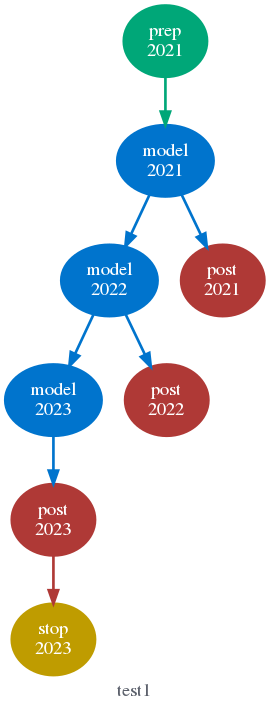

# Table of Contents
{:.no_toc}

* replace-me
{:toc}

## Documentation Links

### Frequently Asked Questions
See [FAQ](./faq.html).

### The Cylc User Guide

If you have access to cylc already, type `cylc doc` or use the GUI "Help" menu
to view the User Guide.  Otherwise, an online copy is available here:

* [Cylc User Guide - PDF ~3MB](doc/cylc-user-guide.pdf)
* [Cylc User Guide - HTML single page](html/single/cug-html.html)
* [Cylc User Guide - HTML multi page](html/multi/cug-html.html)

---

## A Cycling Workflow Example

The following example is intended to convey something of cylc's basic
functionality.  However, it barely scratches the surface; to understand more,
read the User Guide!

### Create A New Suite

    $ mkdir -p /home/bob/suites/test/
    $ vim /home/bob/suites/test/suite.rc

    [cylc]
        cycle point format = %Y

    [scheduling]
       initial cycle point = 2021
       final cycle point = 2023
       [[dependencies]]
          [[[R1]]]  # Initial cycle point.
             graph = prep => model
          [[[R//P1Y]]]  # Yearly cycling.
             graph = model[-P1D] => model => post
          [[[R1/P0Y]]]  # Final cycle point.
             graph = post => stop

    [runtime]
       [[root]]  # Inherited by all tasks.
          script = sleep 10
       [[model]]
          script = echo "my FOOD is $FOOD"; sleep 10
          [[[environment]]]
             FOOD = icecream

    [visualization]
        default node attributes = "style=filled", "shape=ellipse"
        [[node attributes]]
            prep = "fillcolor=#00c798"
            stop = "fillcolor=#ffcc00"
            model = "fillcolor=#00b4fd"
            post = "fillcolor=#ff5966"

### Register It

    $ cylc register my.suite /home/bob/suites/test
    REGISTER my.suite: /home/bob/suites/test

    $ cylc db print my.suite
    my.suite | No title provided | ~/suites/test

    $ cylc edit my.suite  # Open the suite in your editor again.

    $ cylc help  # See other commands!

### Validate It

    $ cylc validate my.suite
    Valid for cylc-6.10.1

### Visualize It

    $ cylc graph my.suite &

### Run It

    $ cylc run my.suite
        # OR
    $ gcylc my.suite &  # (and run it from the GUI)

### View Task Job Output

    $ cylc log -o my.suite model.2021

    JOB SCRIPT STARTING
    cylc Suite and Task Identity:
    Suite Name  : my.suite
    Suite Host  : niwa-34403.niwa.local
    Suite Port  : 7766
    Suite Owner : oliverh
    Task ID     : model.2021
    Task Host   : niwa-34403.niwa.local
    Task Owner  : oliverh
    Task Submit No.: 1
    Task Try No.: 1

    my FOOD is icecream

    cylc (scheduler - 2016-05-18T17:25:18+12): started at 2016-05-18T17:25:18+12
    cylc (scheduler - 2016-05-18T17:25:28+12): succeeded at 2016-05-18T17:25:28+12
    JOB SCRIPT EXITING (TASK SUCCEEDED)
